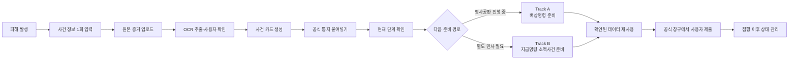
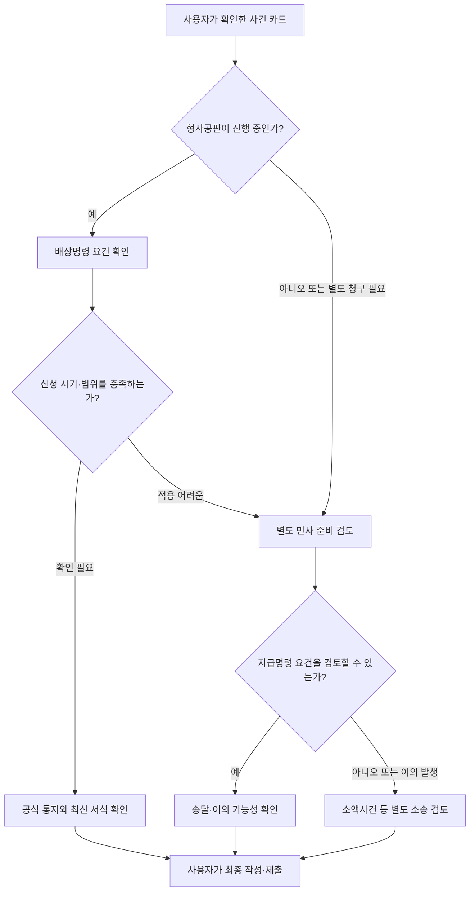
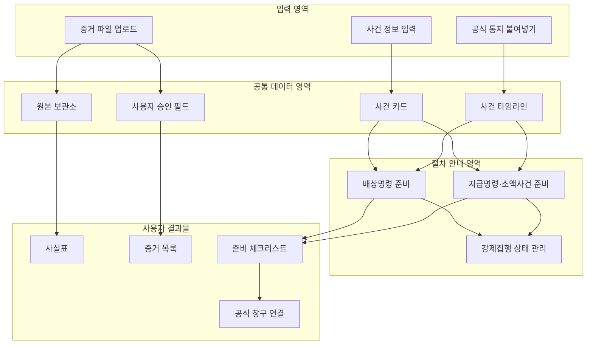
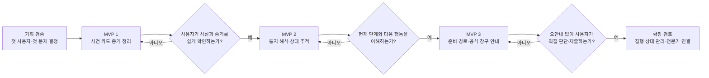
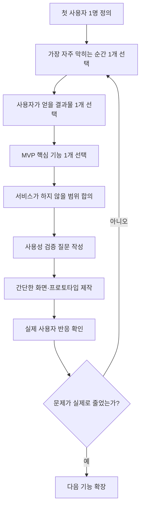

# 소액사기 피해지원 서비스 기획 논의 요약

## 1. 우리가 먼저 생각해야 할 것

이 서비스의 출발점은 “AI로 법률문서를 자동 작성하자”가 아니다.

먼저 다음 질문에 답해야 한다.

1. **누가 사용하는가?**
   - 중고거래·개인 간 거래에서 비교적 소액의 피해를 본 사람
   - 경찰 신고 이후 무엇을 해야 하는지 잘 모르는 사람
   - 변호사를 선임하기에는 비용이 부담되는 사람

2. **사용자는 어디에서 막히는가?**
   - 신고 후 받은 문자·우편의 의미를 이해하기 어렵다.
   - 배상명령과 별도 민사절차 중 무엇을 준비해야 하는지 모른다.
   - 같은 피해 사실과 증거를 절차마다 반복해서 정리해야 한다.
   - 판결이나 지급명령 이후에도 실제 회수를 위해 무엇을 해야 하는지 모른다.

3. **서비스가 해결할 문제는 무엇인가?**
   - 법률 판단 자체가 아니라 **현재 단계와 다음 행동을 알려주는 것**
   - 흩어진 사실과 증거를 **한 번 정리해 계속 재사용하는 것**
   - 절차가 바뀌어도 사용자가 사건의 흐름을 놓치지 않게 하는 것

## 2. 서비스의 한 문장 정의

> 피해자가 한 번 입력한 사건 정보와 증거를 바탕으로 현재 절차를 확인하고, 다음 준비사항과 공식 창구를 안내받는 사용자 통제형 사건 내비게이터

핵심 단어는 **자동화**가 아니라 `정리`, `확인`, `재사용`, `안내`, `추적`이다.

### 전체 사용자 Workflow

이 Workflow에서 AI가 담당하는 부분은 정보 추출과 정리다. 경로의 적용 여부, 문서의 최종 내용과 제출은 사용자가 확인한다.

## 3. 서비스는 어떻게 구성할 것인가

### 1단계. 사건 카드 만들기

사용자가 최초 한 번만 다음 정보를 입력한다.

- 피해 금액과 일시
- 거래 플랫폼과 결제 방식
- 상대방 이름·전화번호·계좌번호 등 단서
- 대화 캡처와 이체확인증
- 경찰·검찰·법원에서 받은 공식 통지

이 정보는 하나의 **사건 카드**로 저장한다.

### 2단계. 증거 정리하기

- 원본 파일은 그대로 보존한다.
- OCR로 금액·날짜·계좌번호 등을 추출한다.
- 추출 결과는 사용자가 원본과 대조하고 승인한다.
- 서로 다른 자료의 내용이 충돌하면 임의로 합치지 않고 표시한다.
- 최종적으로 사실표, 증거 목록, 제출 준비용 사본을 묶는다.

### 3단계. 현재 절차 보여주기

사용자가 받은 문자를 직접 붙여넣으면 다음 항목을 추출한다.

- 기관명
- 사건번호
- 담당 법원 또는 재판부
- 기일
- 현재 절차

추출 결과는 자동 확정하지 않고 원문과 나란히 보여준 뒤 사용자가 확인한다.

### 4단계. 준비 경로 나누기

현재 상황에 따라 두 개의 준비 화면을 제공한다.

- **Track A: 배상명령 준비**
  - 형사재판 진행 여부
  - 신청 가능 시기
  - 준비할 사실과 증거
  - 최신 공식 서식 확인

- **Track B: 별도 민사 준비**
  - 지급명령과 소액사건의 차이
  - 상대방 주소와 송달 가능성
  - 이의가 제기된 경우의 다음 단계
  - 관할·비용·공식 서식 확인

경로 전환은 법률절차의 자동 전환이 아니다. 기존 사건 정보와 증거를 유지한 채 다른 **준비 화면**으로 이동하는 것이다.

### 5단계. 집행 이후까지 추적하기

집행권원을 확보했다고 돈이 자동으로 지급되는 것은 아니다.

서비스는 다음 항목을 하나의 상태판에서 관리한다.

- 집행권원의 종류와 현재 상태
- 확인된 채무자 재산
- 재산명시·재산조회 검토 여부
- 채권압류·추심 검토 여부
- 미회수 상태와 시효 관리

회수 가능성을 예측하거나 보장하지는 않는다.

### 준비 경로 분기 Workflow

이 분기표는 서비스가 법률 결론을 대신 내리는 규칙이 아니다. 사용자가 확인해야 할 질문을 순서대로 보여주는 **준비용 화면 구조**다.

### 제품 모듈 구성도

모든 기능이 각각 별도 데이터를 만드는 방식보다, 중앙의 **사건 카드·원본·승인 필드·타임라인**을 여러 준비 화면이 함께 사용하는 구조가 적합하다.

## 4. MVP에서는 어디까지 만들 것인가

처음부터 모든 기능을 만들지 않는다.

### MVP 1: 사건·증거 정리

- 사건 카드 생성
- 증거 파일 업로드
- OCR 결과 확인
- 사실표와 증거 목록 출력

### MVP 2: 공식 통지 해석과 상태 추적

- 사용자가 붙여넣은 통지에서 핵심 필드 추출
- 원문 대조와 사용자 승인
- 현재 단계와 다음 확인사항 표시

### MVP 3: 준비 경로 안내

- 배상명령 준비 체크리스트
- 지급명령·소액사건 비교
- 확인한 데이터를 다른 준비 화면에서 재사용
- 공식 사이트와 서식 연결

강제집행 대시보드는 사용자 수요와 앞 단계의 유용성을 확인한 뒤 확장한다.

### MVP 개발 순서

## 5. 반드시 정해야 할 기획 쟁점

팀 회의에서는 아래 항목을 우선 결정하면 된다.

1. **첫 사용자**
   - 중고거래 피해자로 한정할 것인가?
   - 다른 소액 전자상거래 피해까지 포함할 것인가?

2. **첫 번째 핵심 기능**
   - 증거 정리인가?
   - 공식 통지 해석인가?
   - 절차 체크리스트인가?

3. **서비스가 책임지는 범위**
   - 정보 정리와 일반 절차 안내까지만 제공할 것인가?
   - 전문가 검토 연결을 포함할 것인가?

4. **사용자가 얻는 최종 결과물**
   - 사건 타임라인
   - 사실표
   - 증거 목록
   - 절차별 준비 체크리스트
   - 공식 창구 이동 링크

5. **검증 방법**
   - 실제 피해자가 현재 단계를 더 쉽게 이해하는가?
   - 같은 정보를 반복 입력하는 횟수가 줄어드는가?
   - 다음 행동을 스스로 확인할 수 있는가?
   - 잘못된 안내를 사용자가 발견하고 수정할 수 있는가?

### 팀 회의 결정 Workflow

## 6. 서비스가 하지 않을 것

- 사기죄 성립 여부를 자동 판단하지 않는다.
- 승소 가능성이나 회수 가능성을 예측하지 않는다.
- 사용자를 대신해 법률문서를 최종 작성하지 않는다.
- 경찰·법원 시스템에 자동 접수하지 않는다.
- 사용자의 확인 없이 추출 정보를 확정하지 않는다.

## 7. 회의에서 정하면 되는 최종 문장

아래 문장을 팀의 임시 합의안으로 두고 수정하면 된다.

> 우리는 소액사기 피해자가 신고 이후 절차를 이해하고 필요한 자료를 반복해서 정리하는 부담을 줄이기 위해, 사건 정보와 증거를 한 번 입력하고 다음 준비사항을 단계별로 확인할 수 있는 서비스를 기획한다.

지금 단계에서 필요한 것은 완성된 법률 플랫폼 설계가 아니다.

**첫 사용자가 가장 자주 막히는 한 지점을 정하고, 그 문제를 해결하는 최소 기능부터 검증하는 것**이다.
