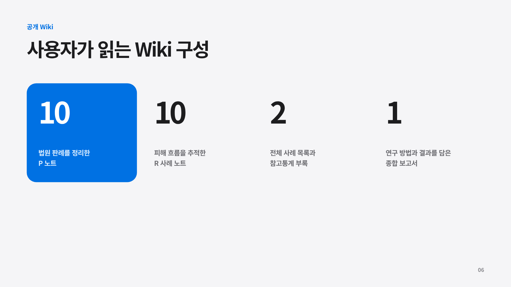
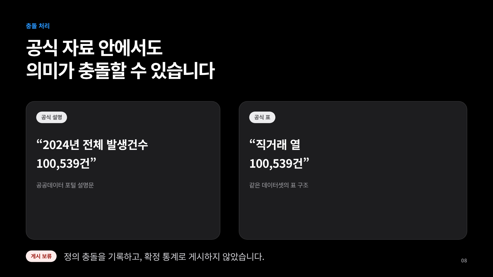

# LLM Wiki 1차 연구 보고

## 요약

LLM Wiki는 대규모 언어모델(Large Language Model, LLM)이 활용할 지식을 출처, 원문 관찰, 주장, 검증 기록으로 연결한 구조화 지식 기반이다. 이번 연구에서는 한국의 중고거래 소액사기와 관련된 법령, 판례, 공공기관 안내, 통계, 사례 기록을 하나의 Markdown Wiki로 정리했다.

현재 Wiki에는 판례 중심 P 문서 10개, 사례 흐름 중심 R 문서 10개, 출처 59개, 원문 관찰 134개, 주장 133개, 검증 기록 208개가 들어 있다. 연구 범위는 12개 영역과 107개 조사 항목으로 나누었으며, 각 항목에 두 차례의 독립 검색을 수행해 총 214개의 검색 기록을 남겼다. 공개 문서의 근거 연결은 Wiki 인용 39개와 보고서 검증 주장 67개로 관리한다. 전체 구조는 [Wiki 안내서](../wiki/README.md), [종합 연구 보고서](../wiki/report.md), [근거 ledger](../wiki/_ledgers/)에서 확인할 수 있다.

## 1. LLM Wiki란 무엇인가

일반적인 문서형 Wiki는 사람이 읽고 탐색하기 좋은 형태로 정보를 정리한다. LLM Wiki는 여기에 언어모델이 근거를 찾고 상태를 구분하는 데 필요한 구조를 더한다. 각 문장은 출처와 연결되고, 확인 수준과 예외가 함께 기록된다.

이 연구에서 사용하는 핵심 용어는 다음과 같다.

- **출처(Source)**: 법령, 판례, 공공기관 안내, 통계, 사례 기록의 원본 위치
- **관찰(Observation)**: 출처에서 직접 확인한 짧은 원문과 위치 정보
- **주장(Claim)**: 관찰을 바탕으로 정리한 하나의 사실 또는 법적 명제
- **검증(Verification)**: 주장과 근거의 연결, 기준일, 예외, 반대 자료를 확인한 기록
- **조사 항목(Cell)**: 12개 연구 영역을 세부 질문으로 나눈 최소 조사 단위
- **MCP(Model Context Protocol)**: 에이전트가 외부 검색 도구와 지식 저장소를 일정한 방식으로 호출하게 해 주는 연결 규격

이 구조를 적용하면 에이전트는 답변에 필요한 주장만 선택하고, 그 주장의 확인 수준과 출처를 함께 제시할 수 있다.

## 2. 연구 목적

소액사기 사건은 신고, 수사, 재판, 배상명령, 민사소송, 판결 확정, 강제집행, 실제 입금이 서로 다른 절차로 이어진다. 온라인 사례 기록에서는 이 단계들이 한 문장 안에 섞이기 쉽다. LLM Wiki는 각 단계를 개별 상태로 기록해 사용자의 현재 위치와 다음 행동을 구체적으로 안내할 수 있도록 설계했다.

이번 1차 연구의 목표는 세 가지다.

1. 공식 자료와 사례 기록을 동일한 근거 체계 안에서 정리한다.
2. 확인된 사실, 제보 수준 정보, 출처 충돌, 추가 조사 필요 상태를 명확하게 구분한다.
3. 새로운 PDF, Markdown, URL 자료가 들어왔을 때 Wiki 초안을 반복해서 생성할 수 있는 입력 흐름을 마련한다.

## 3. Wiki를 구성한 자료

### 3.1 공식 법률 자료

국가법령정보센터의 법령과 대법원 판례를 중심으로 사기죄 성립요건, 전자증거, 형사절차, 배상명령, 민사소송, 송달, 판결 확정, 집행 절차를 조사했다. 법률 주장은 조문 번호, 판결 식별자, 시행일과 기준일을 함께 기록했다.

### 3.2 공공기관 안내

경찰청, 검찰청, 법원, 전자소송 관련 안내, 공공데이터포털 자료를 사용했다. 포털 화면이나 안내문은 접속 시점의 관찰로 기록하며, 로그인 이후의 제출 결과까지 확대해서 해석하지 않는다.

### 3.3 판례 및 사례 문서

판례 중심 P 문서 10개와 실제 사건 흐름을 정리한 R 문서 10개를 유지했다. 각 문서는 기존 파일명, 식별자, 문서 머리말 구조, Obsidian 링크 형식을 그대로 사용한다. 사례 기록의 결과가 공식 자료로 확인되지 않은 경우에는 확인 수준을 본문에 표시한다.

### 3.4 통계와 플랫폼 자료

공공 통계, 안전결제 정책, 플랫폼 안내를 포함했다. 사이버사기 발생 현황 자료의 `100,539건`은 공식 설명에서 전체 발생 건수로 소개되지만 같은 자료의 표에서는 직거래 열에 배치되어 있다. 이 수치는 출처 충돌로 기록하고 공개 결론에서는 보류했다.

*그림 1. 법령·판례·공공기관 자료·사례 기록이 하나의 근거 체계로 모이는 구조*

## 4. 출처에서 검증된 주장까지

연구 자료는 다음 순서로 정리된다.

1. 원본 위치와 식별자를 출처로 등록한다.
2. 실제 문구를 짧은 관찰 단위로 추출하고 원문 위치와 해시를 기록한다.
3. 하나의 의미만 담은 주장으로 정리한다.
4. 근거의 종류, 기준일, 예외, 반대 자료를 검증 기록에 남긴다.
5. 공개 Wiki와 보고서가 해당 주장을 인용한다.

이 연결은 공개 문서의 문장이 어디에서 왔는지 역방향으로 확인할 수 있게 한다. 출처가 바뀌거나 주장의 상태가 달라지면 연결된 공개 문서도 자동 검증 대상이 된다.

*그림 2. 출처, 관찰, 주장, 검증, 공개 문서의 연결*

## 5. 12개 연구 영역

| 영역 | 주요 내용 |
|---|---|
| 연구 범위 | 3천만 원 이하 개인 소액사기, 용어와 경계 |
| 사기 성립요건 | 기망, 착오, 처분행위, 고의, 채무불이행과의 구분 |
| 전자증거 | 대화, 입금 기록, 파일 원본성, 해시, 증거 제출 |
| 형사절차 | 신고, 경찰 수사, 이의신청, 검찰 처분, 재판 |
| 배상명령 | 신청 자격, 시기, 각하, 불복, 민사절차 연결 |
| 민사절차 | 지급명령, 소액사건, 관할, 비용, 이의신청 |
| 송달 | 일반 송달, 공시송달, 효력 발생 시점 |
| 판결과 집행권원 | 항소기간, 확정, 가집행, 집행문 |
| 강제집행 | 재산조회, 압류, 추심, 채무자명부, 회생·파산 |
| 결제수단 | 안전결제, 결제대금예치, 결제정책 |
| 안전·개인정보 | 식별정보 처리, 법률서비스 경계, AI 활용 |
| 통계와 사례 | 발생 건수, 사례 해석, 대표성의 범위 |

이 12개 영역은 107개의 세부 조사 항목으로 분해했다. 예를 들어 민사절차 영역은 지급명령의 관할, 송달 가능성, 이의기간, 필요한 서류를 각각 별도 항목으로 조사한다.

## 6. 공개 Wiki의 구성

사용자가 읽는 공개 영역은 다음 문서로 구성된다.

- 판례 중심 P 문서 10개
- 사례 흐름 중심 R 문서 10개
- 전체 사례 목록
- 참고통계 부록
- Wiki 안내서
- 종합 연구 보고서

P와 R 문서는 `개요`, `처리과정`, `결과`, `비고` 순서로 읽을 수 있다. 공개 문장의 근거는 주장 식별자로 연결되며, 근거 ledger에서 출처까지 추적할 수 있다.

## 7. 확인 수준과 출처 충돌 처리

주장은 확인 상태와 공개 상태를 함께 가진다.

| 상태 | 의미 | 공개 처리 |
|---|---|---|
| 확인됨 | 공식 원문과 검증 기록이 연결됨 | 근거와 기준일을 표시해 공개 |
| 보고됨 | 사례 기록이나 제한된 관찰에 근거함 | 확인 범위를 문장에 표시 |
| 공백 | 필요한 공식 근거를 확보하지 못함 | 후속 조사 항목으로 유지 |
| 기각 | 수치나 결론을 뒷받침할 근거가 부족함 | 결론에서 제외 |
| 보류 | 출처가 충돌하거나 의미가 불명확함 | 충돌 원인과 함께 보류 |

출처 충돌은 한쪽 값을 임의로 선택하지 않고 별도 충돌 기록으로 관리한다. 통계 `100,539건` 사례에서는 공식 설명과 표의 열 의미가 일치하지 않아 두 해석을 모두 보류했다.

*그림 3. 확인 수준에 따라 달라지는 공개 방식*

## 8. 조사 범위와 포화도 확인

107개 조사 항목마다 두 개의 독립 검색 질의를 실행했다. 두 검색 묶음은 서로 다른 질의와 요청으로 구성했으며 총 214개의 항목별 검색 기록을 남겼다.

각 검색 결과는 새 근거인지, 기존 출처의 중복인지, 접근할 수 없는 자료인지 검토했다. 두 검색 묶음의 214개 요청에는 각각 수신 결과와 검토 기록이 연결되어 있다. 최종 검토 기록에서 새로운 핵심 근거 수와 검토 대기 후보 수가 모두 0으로 집계됐다. 세부 결과는 [포화도 기록](../wiki/_ledgers/saturation.md)과 [후보 검토 기록](../wiki/_ledgers/candidates.md)에서 확인할 수 있다.

*그림 4. 107개 항목을 각각 두 번 검색한 조사 구조*

## 9. 자동 검증

`qa:wiki`는 Wiki 전체를 검사하는 자동 검증 명령이다. 다음 문제를 탐지한다.

- 문서 머리말 형식과 고정 식별자 변경
- 존재하지 않는 Wiki 링크와 근거 식별자
- 출처 없는 주장과 순환 참조
- 원문 해시, 기준일, 시행일 불일치
- 개인정보 패턴과 과도한 원문 인용
- 판결, 확정, 집행, 실제 입금 상태의 혼동
- 공개 문서와 근거 ledger 사이의 내용 변경
- 조사 항목, 검색 기록, 검토 후보 수의 불일치

완료 시점의 자동 검증에서는 `servers/`와 `scripts/` 아래의 Bun 테스트 215개를 실행했다. 정상 자료와 의도적으로 깨뜨린 자료를 함께 검사하며, 깨진 링크, 개인정보, 근거 순환, 과장된 통계, 출처 충돌 누락, 조사 기록 변조가 각각 이름이 있는 오류로 검출된다.

## 10. 원천자료 자동 입력

팀원이 새 자료를 추가할 때 사용할 수 있도록 입력 컴파일러를 만들었다. 입력 형식은 로컬 Markdown, 로컬 PDF, URL 참조다.

- Markdown과 PDF는 텍스트를 추출해 출처·관찰·주장 초안을 만든다.
- URL은 외부 내용을 내려받지 않고 참조 주소와 입력 메타정보만 기록한다.
- 전화번호, 계좌번호, 이메일, 주민등록번호, 이름과 주소 패턴을 기본 마스킹한다.
- 동일한 자료는 해시로 표시하고 검토 대상으로 묶는다.
- 생성된 주장은 `보고됨/초안` 상태로 시작한다.
- 기존 공개 문서는 명시적인 교체 옵션이 있을 때만 다시 생성한다.

*그림 5. PDF·Markdown·URL 참조가 검증 가능한 초안으로 변환되는 과정*

## 11. 사용자와 팀이 얻는 효과

### 사용자

- 현재 사건이 신고, 수사, 재판, 확정, 집행, 입금 중 어느 단계인지 구분할 수 있다.
- 단계별로 준비할 증거와 다음 절차를 확인할 수 있다.
- 설명의 근거와 확인 수준을 함께 볼 수 있다.
- 형사절차의 진행과 민사상 실제 회수 과정을 구분해 이해할 수 있다.

### 연구팀

- 새 사례를 반복 가능한 형식으로 빠르게 초안화할 수 있다.
- 자료가 늘어나도 출처와 주장의 연결을 자동 검사할 수 있다.
- 서로 충돌하는 자료와 후속 조사 항목을 별도 목록으로 관리할 수 있다.
- 동일한 지식 기반을 Wiki, 보고서, 에이전트 응답에 함께 사용할 수 있다.

## 12. 에이전트 연결 방향

다음 단계에서는 MCP를 통해 에이전트와 Wiki 검색 도구를 연결한다. 사용자의 질문을 사건 단계와 주제로 분류한 뒤 관련 주장, 관찰, 출처를 순서대로 불러오는 방식이다.

예를 들어 사용자가 “판결문을 받았는데 바로 압류할 수 있나요?”라고 묻는 경우 에이전트는 판결 송달, 항소기간, 확정 여부, 가집행, 집행문, 압류 대상 정보를 각각 조회한다. 답변에는 현재 확인할 항목과 연결된 근거가 함께 표시된다.

이 연결을 적용하면 대규모 Wiki 전체를 한 번에 모델에 넣을 필요가 없다. 질문과 관련된 최소 근거만 선택해 응답에 사용할 수 있다.

## 결론

이번 1차 연구를 통해 소액사기 관련 자료를 사람이 읽는 Wiki와 언어모델이 조회하는 근거 체계로 함께 정리했다. 법령과 판례, 공공기관 안내, 사례 기록, 통계가 출처부터 공개 문장까지 연결되어 있으며, 확인 수준과 충돌 상태도 기계적으로 검사할 수 있다.

현재 결과물은 20개 사례 문서, 59개 출처, 134개 관찰, 133개 주장, 208개 검증 기록, 107개 조사 항목, 214개 검색 기록으로 구성된다. 여기에 원천자료 입력 컴파일러가 결합되어 앞으로 자료가 대규모로 늘어나는 상황에서도 같은 구조와 검증 규칙을 유지할 수 있다.

다음 연구 단계는 MCP 기반 검색 도구를 에이전트에 연결하고 실제 사용자 질문으로 검색 정확도와 응답 흐름을 평가하는 것이다.
