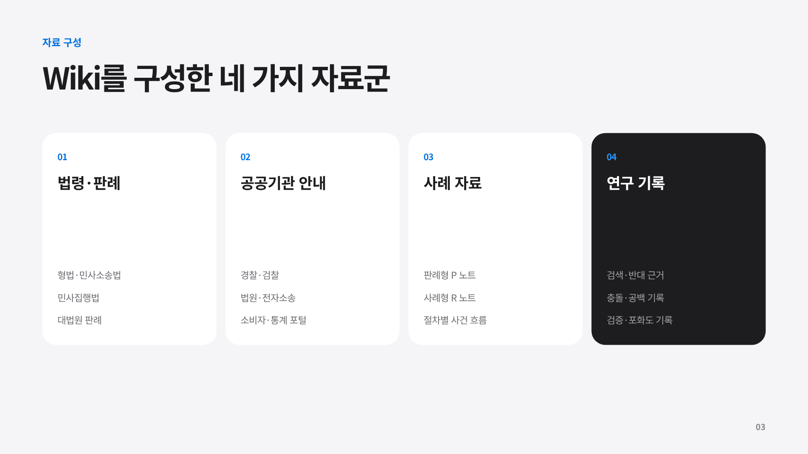
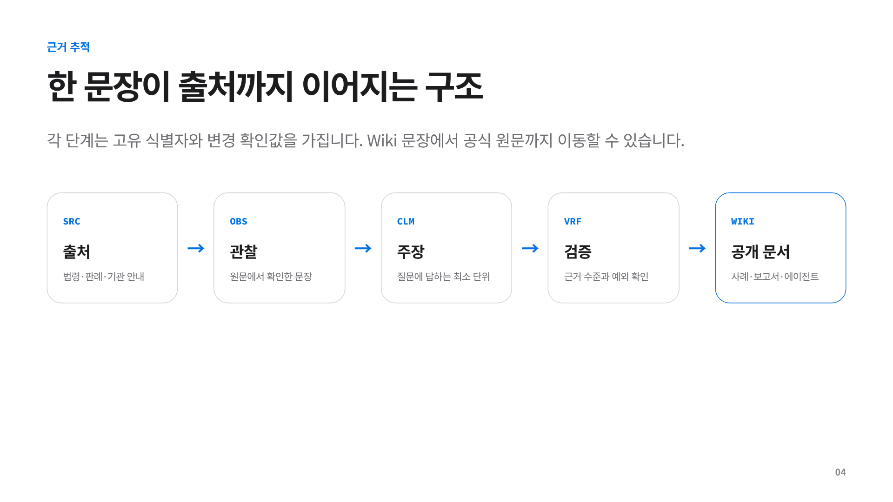
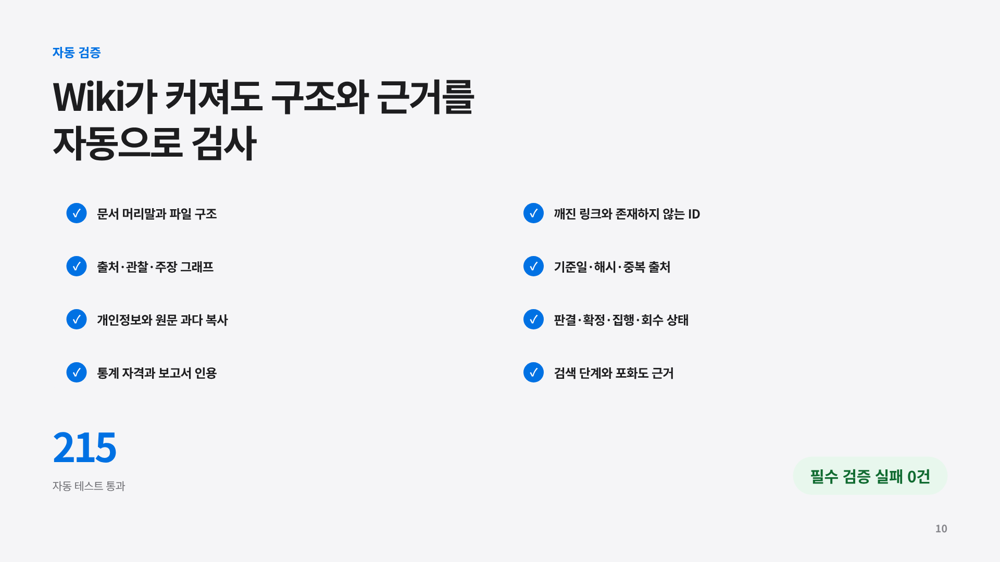

# LLM Wiki 1차 연구 보고

## 요약

이번 연구는 대한민국 온라인 중고거래 사기를 둘러싼 법리와 절차를 20개 사례 문서, 공식 자료, 공공기관 안내와 함께 정리했다. 보고서의 중심은 사례가 보여 주는 거래 양상과 절차의 갈림길이다. 법령과 판례는 각 사례를 읽는 기준을 제공하고, Wiki의 근거 구조는 사례 서술의 확인 범위를 보존한다.

현재 Wiki에는 P 문서 10개와 R 문서 10개, 출처 59개, 원문 관찰 134개, 주장 133개, 검증 기록 208개가 있다. 연구 범위는 12개 영역과 107개 조사 항목으로 나뉘며, 항목별 독립 검색 기록은 214개다. 공개 문서는 [Wiki 안내서](../wiki/README.md), [종합 연구 보고서](../wiki/report.md), [근거 ledger](../wiki/_ledgers/)와 연결된다.

## 1. 수집한 사례

사례 문서는 두 묶음으로 구성된다. P 문서는 판례, 판례 요약, 언론 보도 문맥을 모은 판례 중심 기록이다. R 문서는 개인 후기, 상담 trace, 절차 경험, 플랫폼과 예방 정책 문맥을 모은 기록이다. 각 파일의 `개요`, `처리과정`, `결과`, `비고`를 대조해 사건 서술과 검증 상태를 분리했다.

### 1.1 P 사례, 판례와 보도 문맥

| ID | 제목 | 대표 사실관계와 쟁점 | 처리과정 | 증거 한계와 결과 범위 |
|---|---|---|---|---|
| P1 | 렌탈가전 중고거래 보도·요약 사례 | 렌탈가전을 정상 물품처럼 판매하거나 대금만 받고 발송했다는 서술 | 기소, 자수, 양형사정은 요약 자료에 의존 | 공식 전문, 개별 피해, 배상명령, 확정, 지급 미확인. reported |
| P2 | 중고거래 반복 사기 보도·요약 사례 | 다수 상대 거래, 항소심 병합, 파기와 재선고 언급 | 병합과 재선고를 법원 기록으로 대조하지 못함 | 형량, 개별 배상명령, 지급 미검증. reported |
| P3 | 반복된 중고거래 사기 관련 상고심 요약 사례 | 온라인 거래 외 복수 범죄가 함께 언급된 사건군 | 상고와 병합 절차가 요약 서술에 머묾 | 종합 형량을 대상 거래 결과로 해석할 수 없음. reported |
| P4 | 재정난 속 거래 지속 관련 요약 사례 | 재정난 상태에서 거래를 지속한 사기 성립 판단 문맥 | 거래 당시 의사, 능력과 객관적 사정을 검토하는 법리로 처리 | 이후 미이행이나 경제사정 악화만으로 성립을 단정하지 않음. context |
| P5 | 편취의 범의 판단기준 | 물품거래에서 거래 당시 변제 의사, 능력과 편취 고의가 쟁점 | 기망, 착오, 처분행위, 인과관계를 구별해 판결 전문 확인 | 단순 미변제와 구별하는 공식 법리. 개별 회수 결과는 없음. verified |
| P6 | 부작위에 의한 기망행위 관련 요약 사례 | 중요 사정을 알리지 않은 행위와 고지의무가 쟁점 | 신의칙상 고지의무와 소극적 기망 법리로 정리 | 중고물품 사실관계에 적용한 결론, 유죄, 확정, 지급 미확인. reported |
| P7 | 부작위에 의한 기망의 의미 관련 요약 사례 | 고지의무와 상대방의 중요 착오를 검토하는 법리 | 관련 법리를 사실관계별 판단 기준으로 기록 | 정확한 주문, 파기환송 범위, 중고거래 적용 미검증. reported |
| P8 | 대가 일부 지급된 경우의 편취액 산정 | 일부 대가를 지급한 재물편취 사기의 편취액 산정 | 판결 전문의 형사상 편취액 법리를 확인 | 민사 손해액, 배상명령 범위, 실제 회수액과 구별. verified |
| P9 | 중고거래 허위매물 언론보도 문맥 | 허위매물 거래와 기소, 제1심 진행 보도 | 보도 서술을 문맥으로 보존 | 사건번호, 전문, 형량, 확정, 배상, 지급 미확인. context_only |
| P10 | 조직적 중고거래 사기 언론보도 문맥 | 7년간 다수 피해자를 상대한 조직적 거래 사기 보도 | 보도 문맥으로 기록. R7과 같은 뉴스 가족 | 개별 피해와 회수 자료 없음. 개인 청구의 대표 결과가 아님. context_only |

P 사례에서 공식 전문이 확인된 쟁점은 거래 당시의 고의와 편취액 산정이다. 나머지 기록은 법리의 탐색 단서나 보도 문맥으로 남아 있다. 집단 피해 규모, 복수 범죄의 종합 형량, 보도상 금액을 개인 사건의 결과로 환산하지 않았다.

### 1.2 R 사례, 절차 경험과 예방 문맥

| ID | 제목 | 대표 사실관계와 쟁점 | 처리과정 | 증거 한계와 결과 범위 |
|---|---|---|---|---|
| R1 | 소액 중고거래 민사 절차 reported 사례 | 신원 특정과 민사 절차 뒤 전액 입금 주장 | 사실조회와 당사자 표시 보정 가능성을 절차 단서로 기록 | 판결, 송달, 확정, 실제 지급 자료 미확인. 성공률 아님 |
| R2 | 배상명령 뒤 민사 검토 reported 사례 | 배상명령 각하 뒤 민사 준비 | 배상신청 시기와 각하 사유를 별도 절차로 설명 | 각하는 지급이나 민사 결과가 아님. 접수와 결과 미검증 |
| R3 | 다수 공범 배상명령 준비 unverified 사례 | 공범별 혐의와 배상명령 준비 언급 | 유죄 선고와 법정 요건이 필요한 절차로 정리 | 기소, 사건번호, 신청 기록, 인용, 집행, 지급 미확인 |
| R4 | 조직적 중고거래 피해 후기 reported 사례 | 항소, 상고와 배상신청을 적은 개인 후기 | 불복기간과 확정 상태를 분리해 기록 | 장기 진행, 배상, 지급 미확인 |
| R5 | 민간 신고서비스 언급 개인 후기 unverified 사례 | 민간 신고서비스 등록 뒤 검거와 합의 주장 | 공식 신고 입력과 결과를 분리 | 경찰 기록, 합의서, 지급, 서비스 인과 미확인 |
| R6 | 가짜 이체확인증 판매자 피해 reported 사례 | 허위 이체확인증을 받은 판매자의 형사, 민사 병행 서술 | 정본 송달, 집행권원, 집행 개시를 각각 기록 | AI 요약은 일차 증거가 아니며 판결, 집행, 지급 미검증 |
| R7 | 조직적 사기 관련 플랫폼 정책 논쟁 문맥 | 플랫폼 책임과 안전결제 사칭 위험에 관한 보도 | P10과 같은 뉴스 가족으로 묶어 중복을 방지 | 플랫폼 책임, 보상, 처벌, 지급 결론 없음. context_only |
| R8 | 반복된 발송 지연 상담 reported 사례 | 발송 지연과 일부 환불 상담 | 거래 당시 의사, 능력과 이후 미이행을 구별 | 반복 지연만으로 범죄를 판정하지 않음. 신고와 변제 미확인 |
| R9 | 배상 약속 불이행 민사 검토 reported 사례 | 검거와 배상 약속 뒤 약속 불이행 | 민사 절차의 요건과 형사 절차를 분리 | 소 제기, 판결, 집행, 회수 미확인 |
| R10 | 에스크로 안전결제 예방 문맥 | 안전결제 도입과 감소율 주장 | 개인 간 거래와 사업자 결제대금예치 규칙을 구별 | 원자료와 지표가 없어 감소율, 제품 효과, 인과를 출판하지 않음. context_only |

R 사례의 가치는 절차가 한 단계씩 갈라진다는 점을 보여 주는 데 있다. R1의 입금 주장, R2의 배상명령 각하, R5의 검거와 합의, R9의 배상 약속은 모두 다음 절차를 생각하게 하는 단서다. 각각이 확정 판결이나 실제 지급을 증명하지는 않는다.

### 1.3 사례를 읽을 때의 증거 층위

`verified`는 공식 전문과 검증 기록이 연결된 법리 또는 절차 주장이다. `reported`는 출처가 있으나 개별 사건의 일차 기록을 확인하지 못한 서술이다. `unverified`는 비식별 진술이나 요약에 머문다. `context_only`는 집단 보도, 플랫폼 정책, 예방 문맥이다. 이 구분은 사례의 존재와 사례 결과의 확인 정도를 함께 읽게 한다.

판결, 송달, 확정, 집행권원, 집행행위, 실제 지급은 별도 상태다. 캡처, 대화, 이체 자료의 보존 경위와 해시는 동일성 판단 자료가 될 수 있지만 법원의 증거 채택이나 사실의 진실을 자동으로 확정하지 않는다. 배상신청 준비, 신고, 검거, 합의 약속도 입금을 증명하지 않는다.

## 2. 사례에서 읽는 공통 패턴

첫째, 거래 당시의 사정이 핵심 판단 지점이다. P5는 변제 의사와 능력, 기망, 착오, 처분행위, 인과관계를 구별한다. R8의 발송 지연처럼 거래 뒤에 나타난 미이행만으로 거래 당시의 고의를 확정할 수 없다.

둘째, 형사 절차와 금전 회수의 경로가 갈라진다. 신고와 기소는 수사와 재판의 시작 또는 진행 상태를 보여 준다. 배상명령은 법정 요건과 시기가 있고, 각하 뒤에는 별도 민사 검토가 필요할 수 있다. 확정된 재판과 집행권원이 있어도 실제 지급에는 채무자의 재산과 집행 결과를 따로 확인해야 한다.

셋째, 자료의 규모가 증거의 질을 대신하지 않는다. P2, P9, P10처럼 다수 피해자나 큰 금액이 언급된 보도는 사건 문맥을 제공한다. 개인 청구의 회수율, 예상 기간, 대표 형량으로 바꾸려면 사건번호와 원문, 지급 자료가 필요하다.

넷째, 온라인 도구는 단서와 흐름을 제공한다. R5의 민간 신고서비스와 R10의 안전결제는 예방 또는 절차 선택을 생각하게 하지만 검거, 책임, 보상, 효과의 인과를 증명하지 않는다. 안전결제라는 이름만으로 링크의 진위도 확인되지 않는다.

## 3. 사용자가 사례에서 배울 수 있는 것

사용자는 자신의 자료를 거래 당시와 거래 이후로 나누어 정리할 수 있다. 게시물과 대화, 약속한 물품, 입금 내역, 발송과 환불 기록을 원본과 함께 보존하면 어떤 주장을 어떤 자료로 확인할지 분명해진다. 신고 여부와 별개로 현재 상태를 신고, 수사, 재판, 배상신청, 확정, 집행, 지급 중 하나씩 기록하는 방식도 유용하다.

배상명령이 가능한 시기와 요건, 민사 절차의 송달 가능성, 판결 확정 여부는 서로 다른 확인 항목이다. 사례 문서의 문장을 자신의 사건 결과로 복사하기보다 해당 절차의 공식 안내와 원문을 대조해야 한다. 특히 `reported`, `unverified`, `context_only` 표시는 다음 확인 자료가 무엇인지 알려 주는 표지로 읽을 수 있다.

## 4. 연구 범위와 자료 구성

공식 법령과 판례, 경찰청과 법원 안내, 전자소송 자료, 공공 통계, 플랫폼 정책을 12개 영역으로 나눴다. 사기 성립요건, 전자증거, 형사절차, 배상명령, 민사절차, 송달, 판결 확정, 강제집행, 결제수단, 개인정보와 AI, 통계와 사례를 각각 조사했다. 107개 항목에는 두 차례의 독립 검색을 연결했고, 새 근거와 중복, 접근 불가 자료를 구분했다.

통계는 정의와 표의 범주가 일치하는지 확인했다. `100,539건` 수치는 공식 설명과 표의 열 배치가 충돌해 결론에서 보류했다. R10의 약 95% 감소율도 모집단, 기간, 비교군과 측정 방법을 확인하지 못해 사용하지 않았다.

*그림 1. 법령, 판례, 공공기관 자료, 사례 기록이 하나의 근거 체계로 모이는 구조*

## 5. 근거 구조와 기술 구성

### 5.1 provenance와 검증 흐름

각 자료는 출처 위치와 식별자로 등록한다. 원문에서 짧은 관찰을 뽑고 위치와 해시를 남긴 뒤, 하나의 의미를 담은 주장과 검증 기록을 연결한다. 이 provenance 경로는 보고서 문장이 어느 출처와 관찰에서 왔는지 되짚게 한다. 해시는 동일성 확인을 돕지만 법적 판단을 대신하지 않는다.

*그림 2. 출처, 관찰, 주장, 검증, 공개 문서의 연결*

### 5.2 qa:wiki

`qa:wiki`는 문서 머리말, Wiki 링크, 주장과 출처 식별자, 원문 해시, 기준일, 개인정보 패턴, 상태 혼동, ledger와 공개 문서의 불일치를 검사한다. 조사 항목과 검색 기록, 검토 후보 수의 연결도 점검한다. 이 명령은 사례의 내용을 새로 판정하지 않고 기록된 근거와 상태가 서로 맞는지 확인한다.

### 5.3 intake compiler

intake compiler는 새 Markdown, PDF, URL 참조를 출처와 관찰, 주장 초안으로 바꾼다. URL은 참조 주소와 입력 정보만 기록하며, 생성된 주장은 `reported/초안`에서 시작한다. 개인정보 패턴은 기본 마스킹하고 동일 자료는 해시로 묶는다. 공개 문서는 명시적인 교체가 있을 때만 다시 만든다.

*그림 3. PDF, Markdown, URL 참조가 검증 가능한 초안으로 변환되는 과정*

### 5.4 MCP 연결

MCP(Model Context Protocol)는 에이전트가 Wiki 검색 도구를 일정한 방식으로 호출하게 하는 연결 규격이다. 질문을 사건 단계와 주제로 나누고 관련 claim, observation, source를 순서대로 조회하면 전체 Wiki를 한 번에 넣지 않고 필요한 근거를 선택할 수 있다. 응답에는 확인 상태와 남은 자료 공백을 함께 붙인다.

## 결론

20개 사례는 중고거래 사기를 하나의 결과로 묶지 않는다. 거래 당시의 의사와 능력, 기망의 형태, 증거의 출처, 신고와 재판의 진행, 배상명령과 민사 경로, 확정과 집행, 실제 지급을 각각 확인해야 한다는 점을 보여 준다. P5와 P8의 공식 법리는 판단 기준을 제공하고, 나머지 P와 R 문서는 그 기준을 적용할 때 생기는 사실관계와 자료 공백을 보여 준다.

LLM Wiki는 이 구분을 출처, 관찰, 주장, 검증의 연결로 유지한다. qa:wiki, intake compiler, MCP는 이 근거 구조를 계속 사용할 수 있게 돕는 supporting layer다. 다음 연구에서는 MCP 검색이 사례의 상태와 근거 한계를 정확히 함께 반환하는지 실제 질문으로 평가한다.
