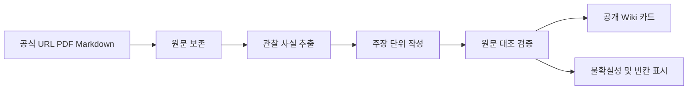
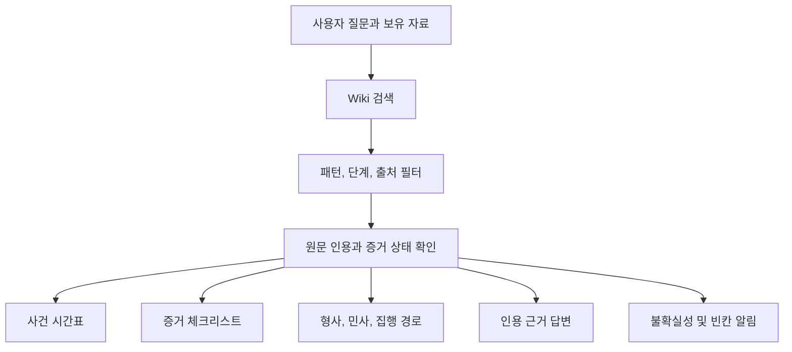
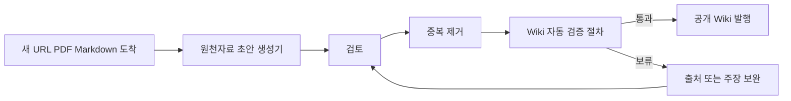

# LLM Wiki 사례 확장과 에이전트 활용

> **한눈에 보기**
> 
> LLM Wiki는 온라인 거래 사기 사례를 공식 원문과 함께 정리한 공개 지식판이다. 사례를 많이 모으는 데서 끝나지 않고, 원문에서 확인한 사실과 아직 비어 있는 정보를 나누어 보여준다. 이번 확장으로 사례 수는 20건에서 40건으로 늘어난다.

## 1. LLM Wiki란 무엇인가

쉽게 말해, **공식 법원 판결문과 검찰 수사 발표를 읽기 쉬운 사례 카드로 바꾼 Wiki**다. 카드에는 거래 방식, 수사와 재판의 단계, 확인된 결과, 근거 원문, 확인하지 못한 항목이 함께 들어간다. 그래서 이용자는 “비슷한 일이 있었나”와 “어느 기관의 어떤 기록으로 확인했나”를 한 화면에서 살필 수 있다.

Wiki는 사건의 결론을 대신 정하거나 피해금 지급을 보장하지 않는다. 판결문에 적힌 유죄와 형량, 배상명령 여부, 실제 지급 여부를 서로 다른 상태로 기록한다.

```mermaid
xychart-beta
    title "공개 사례 수의 확장"
    x-axis [기존, 확장 후]
    y-axis "사례 수" 0 --> 40
    bar [20, 40]
```

## 2. 20건에서 40건으로

기존 20건은 Wiki의 기본 비교군이다. 새로 더하는 20건은 공식 법원 자료 10건과 공식 검찰 및 수사 발표 10건으로 구성한다. 법원 자료는 재판 결과를, 검찰 발표는 수사와 기소의 단서를 보여준다.

| 구분 | 기존 | 이번 추가 | 확장 후 | 읽는 법 |
|---|---:|---:|---:|---|
| 전체 사례 | 20 | 20 | 40 | 비교군과 신규군을 구분 |
| 공식 법원 사례 | 기존 Wiki 수록분 | 10, P11부터 P20 | 기존분과 합산 | 유죄, 형량, 배상명령 등 판결 중심 |
| 공식 검찰 및 수사 흔적 | 기존 Wiki 수록분 | 10, R11부터 R20 | 기존분과 합산 | 수사 발표와 기소 단계 중심 |

### 사례 카드를 읽는 네 축

| 축 | 카드가 답하는 질문 |
|---|---|
| 사기 패턴 | 상품 미배송, 허위 판매, 다수 피해, 계정과 역할 분담처럼 어떤 방식인가? |
| 절차 단계 | 수사 발표, 기소, 판결, 확정, 집행 중 어디까지 공식 기록이 있는가? |
| 증거 상한 | 원문이 직접 확인하는 사실은 어디까지이며, 확인되지 않은 부분은 무엇인가? |
| 이용자 교훈 | 거래 전 확인, 송금 자료 보존, 신고와 배상명령 준비에서 무엇을 챙길 것인가? |

## 3. 새 법원 사례 P11부터 P20

아래 표의 “확인된 단계와 결과”는 제공된 사건번호와 Wiki의 분류 기준에 맞춘 요약이다. 판결문이 직접 말하지 않는 실제 변제와 집행 결과는 확인하지 않은 것으로 남긴다. `판결 확인`은 유죄와 선고 같은 재판 결과의 근거가 있다는 뜻이며, `실제 지급 미확인`은 배상명령 또는 판결만으로 지급을 추정하지 않는다는 뜻이다.

| ID | 사건 및 제목 | 출처 기관 | 확인된 단계와 결과 | 증거 상태 |
|---|---|---|---|---|
| P11 | 2026고단10438, 조직형 중고사기 가상자산 세탁책 | 대한민국 법원, 판결문 | 징역 2년, 배상명령 1건 7,030,000원, 나머지 신청 각하 | 판결문 확인, 실제 지급 미확인 |
| P12 | 2026고단10018, 2026고단10255, 2026고단10402, 자동차부품 허위판매 반복 사기 | 대한민국 법원, 판결문 | 징역 6개월, 배상신청 전부 각하, 일부 회복은 양형에 반영 | 판결문 확인, 실제 지급 미확인 |
| P13 | 2024고단128, 2024고단527, 2024고단758, 2024고단1246, 집행유예 중 다품목 소액사기 | 대한민국 법원, 판결문 | 징역 8개월, 배상신청 전부 각하 | 판결문 확인, 실제 지급 미확인 |
| P14 | 2023고단3201, 지인 계정 침입 결합 판매사기 | 대한민국 법원, 판결문 | 징역 2년 | 판결문 확인, 실제 지급 미확인 |
| P15 | 2022고단1041, 2022고단2055, 2022고단2750, 오더집·장집 역할분담 중고사기 | 대한민국 법원, 판결문 | 징역 1년 4개월, 압수물 환부, 배상신청 전부 각하 | 판결문 확인, 실제 지급 미확인 |
| P16 | 2021고단1527, 구매희망 게시글 역접촉 판매사기 | 대한민국 법원, 판결문 | 징역 1년, 배상명령 2건 | 판결문 확인, 실제 지급 미확인 |
| P17 | 2020고단4183, 구매자 사칭 편의점 택배 회수 절도 | 대한민국 법원, 판결문 | 징역 8개월, 압수 현금과 물품의 교부 및 환부 명령, 별도 배상명령 | context_only, 집행이나 실제 지급은 확인하지 않음 |
| P18 | 2019고단4302, 2019고단4610, 2019고단5106, 2020고단455, 모바일상품권·네이버페이 중고사기 | 대한민국 법원, 판결문 | 징역 1년 6개월, 배상명령 9건, 신청 2건 각하 | 판결문 확인, 실제 지급 미확인 |
| P19 | 2019고단1537, 2019고단1874, 2019고단2822, 게임계정·물품사기 미수·도박 | 대한민국 법원, 판결문 | 징역 1년, 배상명령 1건, 신청 3건 각하 | 판결문 확인, 실제 지급 미확인 |
| P20 | 2017고단1227, 원금 반환 후에도 선고된 실형 | 대한민국 법원, 판결문 | 징역 4개월, 법원이 원금 반환을 인정 | verified official judgment, 실제 지급 상태는 별도 확인 |

### 법원 사례에서 읽을 수 있는 것

| 패턴 | 절차 단계 | 증거 상한 | 이용자 교훈 |
|---|---|---|---|
| 여러 피해자에게 같은 상품을 제시 | 판결과 선고 | 피해자 수와 범행 내용은 판결문 범위 | 게시물, 대화, 계좌, 입금 시각을 함께 보존 |
| 사건번호가 여러 개인 사건군 | 사건별 판결 | 사건 간 병합이나 결과는 원문별 확인 | 사건번호를 섞지 않고 통지 원문과 대조 |
| 절도 유사 사례 | 형사 판결 | 사기 사례의 직접 근거로 확대 금지 | 유사성은 참고하되 죄명과 사실관계를 따로 확인 |

## 4. 새 검찰 및 수사 흔적 R11부터 R20

검찰 발표는 판결문과 다른 종류의 기록이다. 발표에 기재된 혐의, 수사 결과, 기소 여부는 확인할 수 있지만, 그 뒤의 유죄 확정, 배상명령, 실제 지급을 자동으로 읽어낼 수 없다.

| ID | 사건 및 제목 | 출처 기관 | 확인된 단계와 결과 | 증거 상태 |
|---|---|---|---|---|
| R11 | 대전, 마스크와 신발과 스피커 판매 사기, 2020년 3월 13일 | 대전 지역 검찰청 공식 발표 | 구속기소 | 발표 원문 확인, 유죄와 지급 미확인 |
| R12 | 의정부, KF94 마스크와 스포츠도박 결합 사례, 2020년 3월 13일 | 의정부 지역 검찰청 공식 발표 | 구속구공판 | 발표 원문 확인, 후속 재판 미확인 |
| R13 | 대구, 출소 후 마스크 판매, 2020년 3월 17일 | 대구 지역 검찰청 공식 발표 | 구속기소 | 발표 원문 확인, 실제 피해 회복 미확인 |
| R14 | 천안, 마스크 판매와 피해자 8명, 2020년 4월 2일 | 천안 지역 검찰청 공식 발표 | 구속기소 | 발표 원문 확인, 기소 이후 결과 미확인 |
| R15 | 목포, 마스크와 게임머니 판매, 2020년 4월 28일 | 목포 지역 검찰청 공식 발표 | 구속기소 | 발표 원문 확인, 판결과 지급 미확인 |
| R16 | 수원, 청소년을 판매자로 이용한 사례, 2020년 10월 30일 | 수원 지역 검찰청 공식 발표 | 구속기소 | 발표 원문 확인, 역할별 처분은 원문 범위에서만 확인 |
| R17 | 진주, 마스크와 이어폰, 피해자 35명, 2020년 11월 11일 | 진주 지역 검찰청 공식 발표 | 구속기소 | 발표 원문 확인, 실제 배상 미확인 |
| R18 | 청주, 마스크 판매, 피해자 24명, 2020년 4월 27일 | 청주 지역 검찰청 공식 발표 | 구속기소 | 발표 원문 확인, 후속 판결 미확인 |
| R19 | 창원, 캠핑용품과 마스크 판매, 2020년 4월 3일 | 창원 지역 검찰청 공식 발표 | 구속기소 | 발표 원문 확인, 유죄와 지급 미확인 |
| R20 | 성남, 유료 회원 자동결제 은닉, 2014년 4월 24일 | 성남 지역 검찰청 공식 발표 | 불구속기소 | 온라인 물품 사기의 직접 사례로 확대 금지 |

### 검찰 발표에서 얻는 이용자 교훈

마스크, 생활용품, 게임머니처럼 수요가 급증한 물건은 사진과 재고보다 **실제 보유와 발송 가능성**을 먼저 확인해야 한다. 피해자가 여러 명이면 각자의 게시물, 대화, 이체 내역을 같은 형식으로 보존하는 편이 수사 연결에 도움이 된다. 다른 사람을 판매자로 세우거나 자동결제를 숨기는 방식은 거래 상대방이 누구인지와 결제 조건이 무엇인지 확인할 이유를 보여준다.

## 5. 출처에서 공개 Wiki까지

한 사례의 기록은 다음 순서로 만들어진다.



| 단계 | 산출물 | 통과 기준 |
|---|---|---|
| 출처 | URL, PDF, Markdown과 수집 시점 | 기관과 원문 식별 가능 |
| 관찰 | 원문에 실제로 적힌 문장과 숫자 | 해석을 섞지 않음 |
| 주장 | 한 문장으로 제한한 요약 | 관찰 항목으로 추적 가능 |
| 검증 | 인용 위치, 단계, 상태 | 판결과 발표를 혼동하지 않음 |
| 공개 Wiki | 사례 카드와 검색용 분류 | 미확인 항목을 빈칸으로 표시 |

## 6. 에이전트가 Wiki에서 찾고 만드는 것

에이전트는 질문의 핵심어만 검색하지 않는다. 상품 유형, 피해자 수, 거래 방식, 기관, 사건 단계, 판결 결과와 증거 상태를 함께 검색한다. MCP는 **모델이 외부 도구와 자료 저장소를 정해진 방식으로 연결해 읽고 쓰게 하는 통신 규약**이다. MCP를 쓰는 경우에도 공개 Wiki의 출처와 인용 위치가 답변에 남아야 한다.



| 입력 | 검색 결과 | 만들 수 있는 출력 |
|---|---|---|
| 입금일, 대화, 게시물, 통지 | 유사 패턴과 절차 단계 | 사건 시간표, 빠진 날짜 표시 |
| 파일 목록과 원본 대조 | 증거 유형별 사례 | 증거 체크리스트와 미확인 필드 |
| 현재 기관과 사건 단계 | 형사 절차 사례와 공식 창구 | 형사 신고, 민사 청구, 강제집행 경로 |
| “배상받았나”라는 질문 | 배상명령, 판결, 지급 상태 | 인용이 붙은 답변과 실제 지급 미확인 표시 |

형사 신고, 배상명령, 별도 민사 절차, 강제집행은 서로 다른 단계다. 유죄 선고가 곧 피해금 입금은 아니며, 배상명령이 있어도 실제 집행과 지급은 별도 상태로 관리한다.

## 7. 새 자료가 들어오는 날



| 순서 | 확인 내용 |
|---|---|
| 원천자료 초안 생성기 | 원문을 읽고 사례 필드, 출처, 인용 후보를 만든다. |
| 검토 | 관찰과 해석을 나누고 사건 단계와 결과 표현을 확인한다. |
| 중복 제거 | 같은 사건번호, 같은 발표, 같은 PDF의 재수록을 합치되 출처 연결은 보존한다. |
| Wiki 자동 검증 절차 | 필수 필드, 인용 위치, Mermaid 문법, 중복, 미확인 상태를 점검한다. |
| 발행 | 통과한 카드만 공개하고 보류 카드는 공개 주장에 포함하지 않는다. |

## 8. 현재 상태와 다음 단계

### 지금 확인되는 범위

* 공개 사례 수의 목표 구조는 기존 20건과 신규 20건, 합계 40건이다.
* P11부터 P20은 법원 판결 자료, R11부터 R20은 검찰의 공식 발표 자료로 역할이 다르다.
* 법원 판결, 검찰 발표, 배상명령, 실제 지급을 한 문장으로 합치지 않는 분류가 핵심이다.
* 에이전트 출력은 원문 인용, 증거 상태, 불확실성 알림을 포함해야 한다.

### 다음 공개 단계

1. 각 사례 카드에 원문 URL 또는 PDF 식별자와 인용 위치를 연결한다.
2. 여러 사건번호가 묶인 P12와 P18은 사건별 결과를 분리해 검토한다.
3. 배상명령의 존재와 실제 지급 또는 집행 완료를 별도 필드로 채운다.
4. R11부터 R19의 발표 뒤 기소와 판결 자료가 확인되면 새 출처로 연결한다.
5. P20과 R20 같은 비교 맥락 사례에는 검색 결과의 직접 적용 범위를 제한하는 표지를 유지한다.

> **판단 기준**
> 
> Wiki의 신뢰도는 사례 수보다 출처와 주장 사이의 연결, 확인된 단계와 확인되지 않은 단계의 구분에서 나온다. 지금은 40건 구조와 분류 체계가 잡힌 상태다. 다음 공개 단계의 성패는 원문 인용과 후속 결과를 카드별로 채우는 데 달려 있다.

## 신규 원문 노트
- [P11_조직형_중고사기_가상자산_세탁책.md](../wiki/P11_조직형_중고사기_가상자산_세탁책.md)
- [P12_자동차부품_허위판매_반복_사기.md](../wiki/P12_자동차부품_허위판매_반복_사기.md)
- [P13_집행유예_중_다품목_소액사기.md](../wiki/P13_집행유예_중_다품목_소액사기.md)
- [P14_지인_계정_침입_결합_판매사기.md](../wiki/P14_지인_계정_침입_결합_판매사기.md)
- [P15_오더집_장집_역할분담_중고사기.md](../wiki/P15_오더집_장집_역할분담_중고사기.md)
- [P16_구매희망_게시글_역접촉_판매사기.md](../wiki/P16_구매희망_게시글_역접촉_판매사기.md)
- [P17_구매자_사칭_편의점_택배_회수_절도.md](../wiki/P17_구매자_사칭_편의점_택배_회수_절도.md)
- [P18_모바일상품권_네이버페이_중고사기.md](../wiki/P18_모바일상품권_네이버페이_중고사기.md)
- [P19_게임계정_물품사기_미수_도박.md](../wiki/P19_게임계정_물품사기_미수_도박.md)
- [P20_원금_반환_후에도_선고된_실형.md](../wiki/P20_원금_반환_후에도_선고된_실형.md)
- [R11_대전_마스크_운동화_스피커_사건.md](../wiki/R11_대전_마스크_운동화_스피커_사건.md)
- [R12_의정부_마스크_판매_도박_사건.md](../wiki/R12_의정부_마스크_판매_도박_사건.md)
- [R13_대구_출소_후_마스크_판매_사건.md](../wiki/R13_대구_출소_후_마스크_판매_사건.md)
- [R14_천안_중고거래_마스크_사건.md](../wiki/R14_천안_중고거래_마스크_사건.md)
- [R15_목포_마스크_게임머니_판매_사건.md](../wiki/R15_목포_마스크_게임머니_판매_사건.md)
- [R16_청소년_판매책_이용_중고의류_사건.md](../wiki/R16_청소년_판매책_이용_중고의류_사건.md)
- [R17_진주_마스크_이어폰_반복_판매_사건.md](../wiki/R17_진주_마스크_이어폰_반복_판매_사건.md)
- [R18_청주_마스크_반복_판매_사건.md](../wiki/R18_청주_마스크_반복_판매_사건.md)
- [R19_창원_캠핑용품_마스크_반복_판매_사건.md](../wiki/R19_창원_캠핑용품_마스크_반복_판매_사건.md)
- [R20_무료사이트_제휴숨김_소액자동결제_사건.md](../wiki/R20_무료사이트_제휴숨김_소액자동결제_사건.md)
