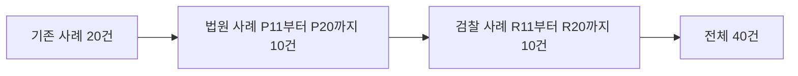
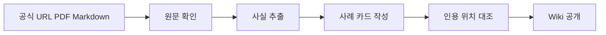
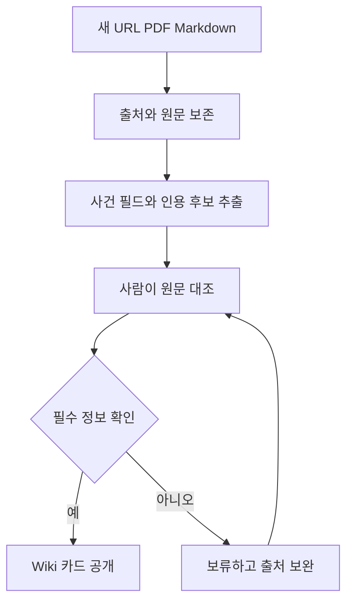
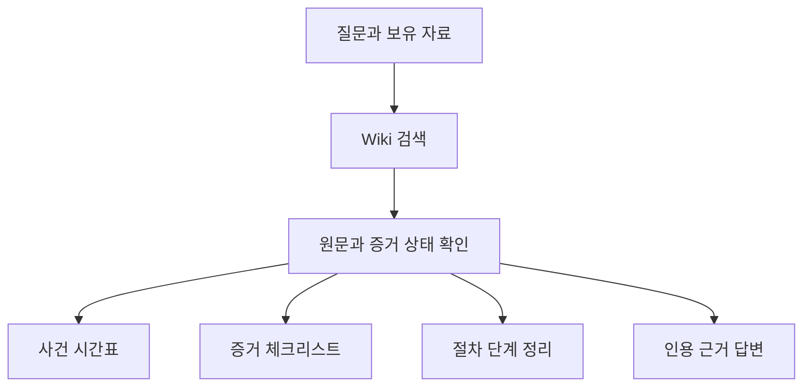

# LLM Wiki 사례 확장과 에이전트 활용

## 한눈에 보기

LLM Wiki는 온라인 거래 사기 사례를 공식 자료와 함께 정리한 지식판입니다. 이번 확장으로 사례가 20건에서 40건으로 늘어납니다.

새 사례 20건은 두 묶음입니다.

* P11부터 P20까지 10건은 법원 판결 자료입니다.
* R11부터 R20까지 10건은 검찰의 수사와 기소 발표 자료입니다.

자료마다 확인할 수 있는 범위가 다릅니다. 판결문은 선고 결과를 보여줍니다. 검찰 발표는 수사와 기소 단계까지 보여줍니다.

## LLM Wiki란 무엇인가

LLM은 글을 읽고 질문에 답하는 인공지능입니다. Wiki는 여러 자료를 주제별로 모아 찾기 쉽게 만든 문서 모음입니다.

LLM Wiki는 두 가지를 함께 담습니다.

1. 사건에서 확인된 사실
2. 그 사실을 뒷받침하는 공식 원문

사례 카드에는 거래 방식, 사건 단계, 판결 결과, 출처가 들어갑니다. 확인하지 못한 내용은 빈칸이나 별도 상태로 남깁니다. 그래서 이용자는 비슷한 사건을 찾고, 근거 자료까지 바로 확인할 수 있습니다.

## 정보는 어떻게 정리되나요

각 사례는 다음 네 가지 질문에 답합니다.

| 항목 | 쉬운 질문 |
|---|---|
| 사기 방식 | 어떤 물건을 어떻게 팔았나? |
| 절차 단계 | 수사, 기소, 판결 중 어디까지 갔나? |
| 증거 상태 | 원문에서 직접 확인되는 내용은 무엇인가? |
| 이용자 교훈 | 거래 자료와 신고 준비에서 무엇을 챙길까? |

자료는 먼저 원문으로 보관합니다. 그다음 원문에 적힌 사실을 뽑습니다. 마지막으로 사실과 주장을 대조해 Wiki 카드로 만듭니다.

## 새로 들어온 대표 사례

### 법원 자료 P11부터 P20

* **P11**은 조직형 중고사기와 가상자산 세탁책 사례입니다. 징역 2년과 한 신청인에게 703만 원을 지급하라는 배상명령이 확인됩니다. 실제 지급은 확인되지 않습니다.
* **P12**는 자동차부품을 반복해서 허위 판매한 사례입니다. 징역 6개월이 선고되었습니다. 배상신청은 모두 각하되었습니다. 양형 이유에 일부 피해 회복이 적혀도 세부 지급 자료는 공개되지 않았습니다.
* **P13**은 집행유예 기간에 여러 물품을 소액으로 판매한 사례입니다. 징역 8개월이 선고되었고 배상신청은 모두 각하되었습니다.
* **P14**는 지인의 계정 침입과 판매사기가 결합된 사례입니다. 징역 2년이 선고되었습니다.
* **P15**는 오더집과 장집으로 역할을 나눈 중고사기 사례입니다. 징역 1년 4개월이 선고되었고 압수물 한 점의 환부 명령이 있었습니다.
* **P16**은 구매 희망 글을 보고 먼저 연락하는 방식의 판매사기 사례입니다. 징역 1년과 배상명령 2건이 확인됩니다.
* **P17**은 구매자를 사칭해 편의점 택배를 회수한 절도 사례입니다. 이 자료는 비교 맥락을 보여주는 `context_only` 자료입니다. 징역 8개월과 압수 현금 및 물품의 교부와 환부 명령이 확인됩니다. 집행과 실제 지급은 확인하지 않습니다.
* **P18**은 모바일상품권과 네이버페이를 이용한 중고사기 사례입니다. 징역 1년 6개월, 배상명령 9건, 각하된 신청 2건이 확인됩니다.
* **P19**는 게임계정과 물품사기, 미수, 도박이 함께 나온 사례입니다. 징역 1년과 배상명령 1건이 확인됩니다. 신청 3건은 각하되었습니다.
* **P20**은 원금을 돌려준 뒤에도 실형이 선고된 사례입니다. 징역 4개월이 선고되었고, 법원은 원금 반환을 양형에 반영했습니다. 실제 지급 상태는 별도로 확인되지 않습니다.

### 검찰 자료 R11부터 R20

R11부터 R19까지는 공식 발표에서 구속 기소 단계가 확인됩니다. R12는 구속 구공판입니다. 발표 뒤 유죄판결, 판결 확정, 배상명령, 합의, 실제 지급은 이 자료만으로 확인되지 않습니다.

대표적으로 마스크, 운동화, 스피커, 게임머니, 중고의류, 이어폰, 캠핑용품을 판매한 사례가 있습니다. R17은 피해자 35명, R18은 피해자 24명이 언급됩니다. 여러 피해자의 자료를 같은 방식으로 모으면 사건의 연결을 살피는 데 도움이 됩니다.

R20은 무료 사이트의 제휴 사실을 숨기고 소액 자동결제를 한 사례입니다. 불구속 기소까지 확인됩니다. 개인별 금액이 없어 `context_only`로 관리합니다. 온라인 물품 사기의 직접 사례로 넓혀 읽지 않습니다.

## URL, PDF, Markdown 자료를 넣는 방법

새 자료가 들어오면 출처 주소와 파일을 먼저 보존합니다. 원문에 적힌 문장과 숫자를 뽑고, 사건 단계와 결과를 따로 기록합니다. 같은 사건이 이미 있으면 사건번호와 출처를 대조해 중복을 줄입니다. 최종 카드에는 원문 링크와 인용 위치를 남깁니다.

자동화 도구는 초안을 만들고 중복, 필수 항목, 인용 위치를 점검할 수 있습니다. 원문과 맞지 않는 주장은 공개 카드에 넣지 않습니다.

## 에이전트가 만들 수 있는 결과

에이전트는 Wiki를 읽고 질문에 맞는 사례를 찾아 정리하는 프로그램입니다. 질문과 함께 게시물, 대화, 입금 내역, 기관 통지 같은 자료를 넣을 수 있습니다.

에이전트는 다음 결과를 만들 수 있습니다.

* 사건별 시간표
* 빠진 날짜와 자료를 보여주는 증거 체크리스트
* 비슷한 거래 방식의 사례 묶음
* 형사 신고, 배상명령, 민사 청구, 강제집행의 단계 정리
* 원문 인용이 붙은 답변
* 확인된 내용과 아직 모르는 내용을 나눈 결과

MCP는 **인공지능이 외부 자료와 도구를 정해진 방식으로 연결해 읽고 쓰게 하는 통신 규칙**입니다. MCP를 사용하면 에이전트가 Wiki 검색 도구나 자료 보관소를 연결해 쓸 수 있습니다.

## 증거 상태와 불확실성

사례를 읽을 때는 결과의 종류를 나누어야 합니다.

| 상태 | 뜻 |
|---|---|
| 판결문 확인 | 판결문에 선고나 배상명령이 적혀 있음 |
| 기소 확인 | 검찰 발표에서 기소 단계가 적혀 있음 |
| context_only | 주변 맥락을 보여주며 핵심 결과를 확정하는 자료로 쓰지 않음 |
| 실제 지급 미확인 | 배상명령이나 원금 반환 기록만으로 실제 입금을 확인하지 않음 |
| 후속 결과 미확인 | 기소 뒤 판결이나 확정 결과를 찾지 못함 |

징역형 선고는 형사재판의 결과입니다. 배상명령은 피해금 지급을 명하는 재판상 조치입니다. 실제 입금이나 집행 완료는 별도 확인이 필요합니다.

R11부터 R20은 기소 단계의 자료입니다. 공개된 공소사실은 재판에서 확정된 사실과 구분해 읽습니다. P17은 `context_only`로 제한하며, 절도 사례의 내용을 일반적인 중고사기 결과로 넓히지 않습니다.

## 원문 링크

### 법원 판결 자료

* [P11 조직형 중고사기와 가상자산 세탁책](../wiki/P11_조직형_중고사기_가상자산_세탁책.md)
* [P12 자동차부품 허위판매 반복 사기](../wiki/P12_자동차부품_허위판매_반복_사기.md)
* [P13 집행유예 중 다품목 소액사기](../wiki/P13_집행유예_중_다품목_소액사기.md)
* [P14 지인 계정 침입 결합 판매사기](../wiki/P14_지인_계정_침입_결합_판매사기.md)
* [P15 오더집 장집 역할분담 중고사기](../wiki/P15_오더집_장집_역할분담_중고사기.md)
* [P16 구매희망 게시글 역접촉 판매사기](../wiki/P16_구매희망_게시글_역접촉_판매사기.md)
* [P17 구매자 사칭 편의점 택배 회수 절도](../wiki/P17_구매자_사칭_편의점_택배_회수_절도.md)
* [P18 모바일상품권 네이버페이 중고사기](../wiki/P18_모바일상품권_네이버페이_중고사기.md)
* [P19 게임계정 물품사기 미수 도박](../wiki/P19_게임계정_물품사기_미수_도박.md)
* [P20 원금 반환 후에도 선고된 실형](../wiki/P20_원금_반환_후에도_선고된_실형.md)

### 검찰 발표 자료

* [R11 대전 마스크 운동화 스피커 사건](../wiki/R11_대전_마스크_운동화_스피커_사건.md)
* [R12 의정부 마스크 판매 도박 사건](../wiki/R12_의정부_마스크_판매_도박_사건.md)
* [R13 대구 출소 후 마스크 판매 사건](../wiki/R13_대구_출소_후_마스크_판매_사건.md)
* [R14 천안 중고거래 마스크 사건](../wiki/R14_천안_중고거래_마스크_사건.md)
* [R15 목포 마스크 게임머니 판매 사건](../wiki/R15_목포_마스크_게임머니_판매_사건.md)
* [R16 청소년 판매책 이용 중고의류 사건](../wiki/R16_청소년_판매책_이용_중고의류_사건.md)
* [R17 진주 마스크 이어폰 반복 판매 사건](../wiki/R17_진주_마스크_이어폰_반복_판매_사건.md)
* [R18 청주 마스크 반복 판매 사건](../wiki/R18_청주_마스크_반복_판매_사건.md)
* [R19 창원 캠핑용품 마스크 반복 판매 사건](../wiki/R19_창원_캠핑용품_마스크_반복_판매_사건.md)
* [R20 무료 사이트 제휴 숨김 소액 자동결제 사건](../wiki/R20_무료사이트_제휴숨김_소액자동결제_사건.md)
