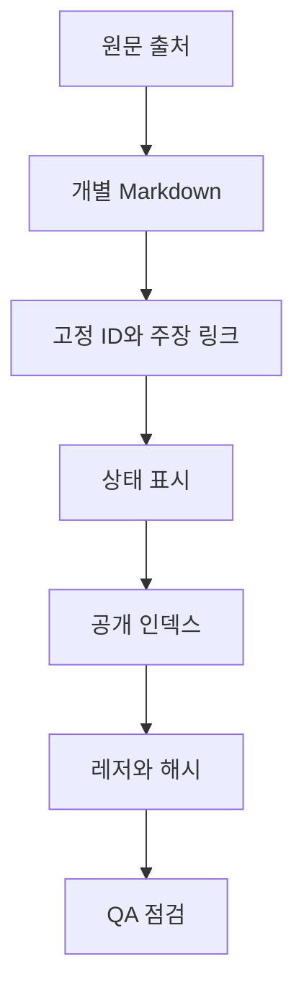
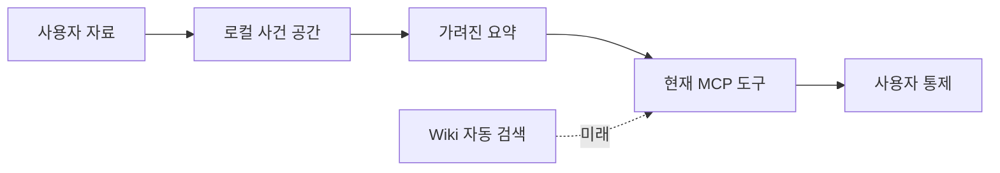
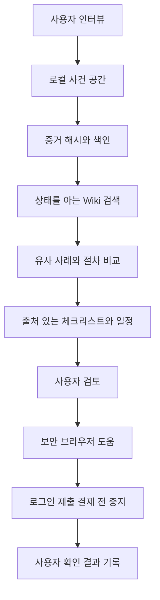
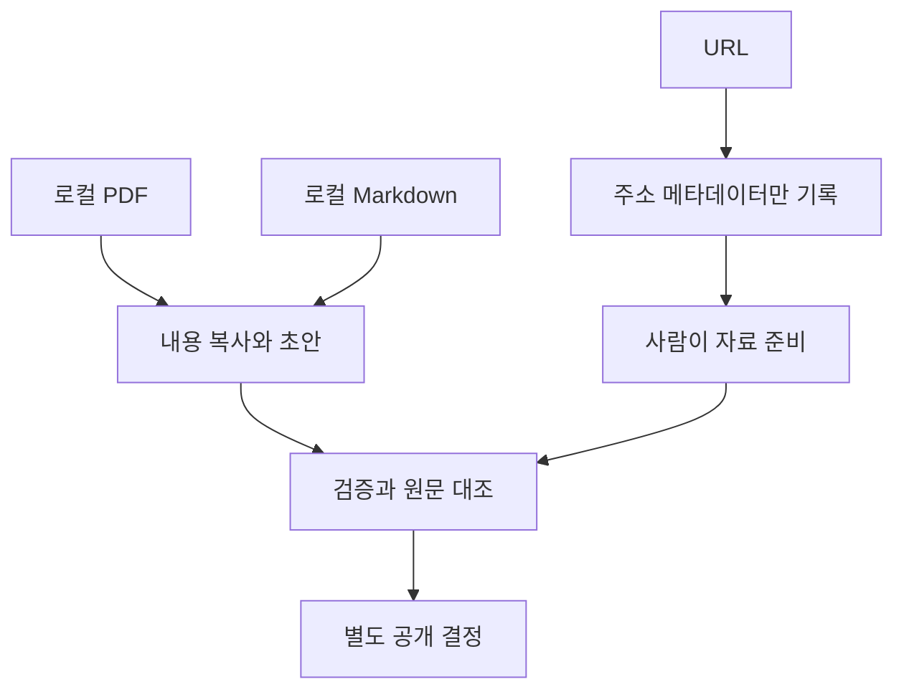

# LLM Wiki 사례 확장과 에이전트 활용, 쉬운 안내서

이 글은 기술을 모르는 분을 위한 설명입니다. 여기서 말하는 사례는 주로 대한민국 온라인 거래 사기와 그 주변 절차입니다. 기준 범위는 개인 청구액 3,000만 원 이하입니다.

## 먼저 한 문장으로

LLM은 많은 글을 읽고 질문에 답하는 인공지능입니다. Wiki는 주제별 문서 모음입니다. 공개 자료를 확인한 범위에서 **LLM Wiki라는 말은 세계적으로 통일된 표준 용어가 아닙니다.** 이 프로젝트에서 LLM Wiki는 LLM과 에이전트가 읽기 쉽도록 만든, 출처 링크가 붙은 선별 Markdown 지식 모음이라는 뜻입니다. Markdown은 제목과 표를 간단한 기호로 적는 문서 형식입니다.

Andrej Karpathy의 [LLM Wiki 개념 메모](https://gist.github.com/karpathy/442a6bf555914893e9891c11519de94f)는 이 말을 하나의 추상적인 설계 방식으로 설명합니다. 원문 자료는 바꾸지 않고 보관하고, 오래 남는 Markdown Wiki에 정리하며, 문서 형식과 작성 규칙을 정하고, 자료를 넣는 작업, 질문하는 작업, 규칙을 검사하는 작업을 나누자는 생각입니다. 여기서 추상적이라는 말은 특정 제품 하나의 설명이 아니라, 여러 프로젝트에 적용할 수 있는 설계 그림이라는 뜻입니다.

그 메모가 LLM Wiki의 공식 표준을 정한 것은 아닙니다. 이 프로젝트도 그 메모를 그대로 구현했다고 말하지 않습니다. 우리 저장소는 사례별 Markdown 페이지, 고정 ID, 출처와 주장 링크, 상태, 레저와 해시, QA를 실제로 사용합니다. 반면 Wiki 질의 MCP 도구와 의미 검색은 아직 없습니다. 따라서 개념의 공통점은 자료를 오래 보존하고 규칙으로 관리한다는 데 있고, 실제 기능과 범위는 이 저장소의 코드와 기록을 기준으로 판단해야 합니다.

이 Wiki는 법률 자문이나 결과 보장 자료가 아닙니다. 같은 사건이라도 판결, 기소, 송달, 확정, 집행, 실제 입금은 서로 다른 상태입니다.

## 40건은 네 묶음으로 읽습니다

P는 판결과 법리, 관련 보도 묶음이고, R은 신고와 수사, 기소 같은 절차 자료 묶음입니다. P1부터 P10, R1부터 R10은 먼저 모인 자료입니다. 대부분 보도, 개인 경험, 검증 전 맥락, 법리 설명용 씨앗입니다. 모두 공식 판결이나 실제 회수 결과로 읽으면 안 됩니다.

P11부터 P20은 공식 법원 판결 자료입니다. 다만 P17은 중고사기 결과가 아니라 구매자 사칭 절도 판결을 비교 맥락으로만 둔 `context_only` 자료입니다. R11부터 R20은 공식 검찰 발표에 담긴 기소 추적 자료입니다. 유죄 판결을 뜻하지 않습니다. R20은 무료 사이트의 제휴 사실을 숨긴 소액 자동결제 사건으로, 비교 맥락인 `context_only`입니다.

### P1부터 P10, 먼저 모은 판결·법리·보도 씨앗

| ID와 원문 | 쉬운 설명 | 증거가 말할 수 있는 최대 범위 |
|---|---|---|
| [P1 렌탈가전](../wiki/P1_렌탈가전_속여_판_중고거래_사기.md) | 렌탈 가전을 속여 판 사례 | 보도와 맥락, 공식 전문 미확인 |
| [P2 57명 반복 거래](../wiki/P2_중고나라_57명_상대_반복_사기.md) | 여러 피해자에게 반복 판매한 사례 | 보고된 추적, 판결 전문과 지급 미확인 |
| [P3 반복 거래](../wiki/P3_반복된_중고거래_사기.md) | 반복 중고거래와 여러 혐의를 다룬 사례 | 보고된 추적, 혼합 혐의 구분 필요 |
| [P4 재정난 중 거래](../wiki/P4_재정난_속_거래_지속.md) | 돈이 부족한데 거래를 계속한 상황의 법리 | 맥락용 법리, 개별 결과 미확인 |
| [P5 편취 의도](../wiki/P5_편취의_범의_판단기준.md) | 처음부터 속일 의도가 있었는지 보는 기준 | 검증된 법리 초안, 개별 사건 결과 미공개 |
| [P6 부작위 기망](../wiki/P6_부작위에_의한_기망행위.md) | 말하지 않은 사실이 문제가 되는지 보는 법리 | 보고된 법리 맥락 |
| [P7 부작위 의미](../wiki/P7_부작위에_의한_기망의_의미.md) | 침묵이 속임수가 될 수 있는 조건 | 보고된 법리 맥락 |
| [P8 일부 대가 지급](../wiki/P8_대가_일부_지급된_경우의_편취액_산정.md) | 일부 돈을 받은 경우 손해액을 따지는 법리 | 검증된 법리 초안, 민사 손해와 개별 사건 결과는 별도 |
| [P9 2억 원 허위매물](../wiki/P9_중고거래_허위매물_2억원_편취.md) | 큰 규모 허위매물 보도 | 뉴스 맥락, 개인 결과와 공식 전문 미확인 |
| [P10 5,600여 명](../wiki/P10_7년간_5,600여_명_상대_조직적_중고거래.md) | 장기간 다수 상대 조직형 거래 보도 | 뉴스 맥락, 대표 결과와 회수 미확인 |

### R1부터 R10, 오래된 절차와 경험 씨앗

| ID와 원문 | 쉬운 설명 | 증거가 말할 수 있는 최대 범위 |
|---|---|---|
| [R1 30만 원 거래](../wiki/R1_30만원_중고거래_사기.md) | 소액 피해자가 절차를 알아본 기록 | 보고된 경험, 판결과 입금 미확인 |
| [R2 배상명령 뒤 민사](../wiki/R2_배상명령_각하_이후_민사소송으로_전환한_사례.md) | 배상명령 신청이 각하되어 민사를 검토한 흐름 | 보고된 추적, 민사 결과 미확인 |
| [R3 다수 공범](../wiki/R3_다수_공범_중고거래_사기.md) | 공범이 여러 명인 사건의 준비 과정 | 미검증 진행 기록 |
| [R4 조직적 피해](../wiki/R4_조직적_중고거래_사기_피해.md) | 조직형 거래로 피해를 봤다는 경험 | 보고된 일화, 결과 미확인 |
| [R5 신고 뒤 검거](../wiki/R5_더치트_신고_후_6개월_만에_검거.md) | 신고 후 검거됐다는 개인 경험 | 검증되지 않은 경험, 회수 대표성 없음 |
| [R6 가짜 이체증](../wiki/R6_가짜_이체확인증_사기.md) | 가짜 입금 확인증을 둘러싼 분쟁 | 보고된 추적, 확정과 집행 미확인 |
| [R7 조직 사기와 플랫폼](../wiki/R7_조직적_사기_관련.md) | 플랫폼 책임을 둘러싼 보도 맥락 | 정책 책임 결론이 아닌 맥락 |
| [R8 발송 지연](../wiki/R8_반복된_발송_지연.md) | 발송을 계속 미룬 거래 경험 | 신고 전 보고 기록, 범죄 확정 아님 |
| [R9 배상 약속 불이행](../wiki/R9_검거_후_배상_약속_불이행.md) | 검거 뒤 돈을 주겠다는 약속이 지켜지지 않은 경험 | 보고된 추적, 입금과 처분 미확인 |
| [R10 안전결제](../wiki/R10_에스크로_안전결제_도입.md) | 안전결제 도입을 다룬 예방 맥락 | 예방 맥락, 효과 수치는 보류 |

### P11부터 P20, 공식 법원 판결

| ID와 원문 | 쉬운 설명 | 증거가 말할 수 있는 최대 범위 |
|---|---|---|
| [P11 조직형과 가상자산](../wiki/P11_조직형_중고사기_가상자산_세탁책.md) | 조직형 중고사기와 가상자산 세탁책 | 공식 판결, 징역 2년과 배상명령 확인, 실제 지급 별도 |
| [P12 자동차부품](../wiki/P12_자동차부품_허위판매_반복_사기.md) | 자동차부품 허위 판매를 반복 | 공식 판결, 징역 6개월, 배상신청 각하 |
| [P13 집행유예 중 소액사기](../wiki/P13_집행유예_중_다품목_소액사기.md) | 집행유예 중 여러 물건을 판매 | 공식 판결, 징역 8개월, 배상신청 각하 |
| [P14 계정 침입 결합](../wiki/P14_지인_계정_침입_결합_판매사기.md) | 지인 계정 침입과 판매사기가 함께 발생 | 공식 판결, 징역 2년 |
| [P15 역할 분담](../wiki/P15_오더집_장집_역할분담_중고사기.md) | 오더집과 장집으로 역할을 나눈 사기 | 공식 판결, 징역 1년 4개월, 환부 명령 |
| [P16 구매희망자 역접촉](../wiki/P16_구매희망_게시글_역접촉_판매사기.md) | 구매 희망 글을 보고 먼저 접근 | 공식 판결, 징역 1년과 배상명령 2건 |
| [P17 구매자 사칭 절도](../wiki/P17_구매자_사칭_편의점_택배_회수_절도.md) | 구매자를 사칭해 택배를 가져간 절도 | `context_only`, 공식 절도 판결, 지급과 집행 미확인 |
| [P18 상품권과 네이버페이](../wiki/P18_모바일상품권_네이버페이_중고사기.md) | 모바일상품권과 네이버페이를 이용 | 공식 판결, 징역 1년 6개월, 배상명령 일부 확인 |
| [P19 게임계정과 도박](../wiki/P19_게임계정_물품사기_미수_도박.md) | 게임계정, 물품사기 미수, 도박이 함께 등장 | 공식 판결, 징역 1년, 배상명령 일부 확인 |
| [P20 원금 반환 뒤 실형](../wiki/P20_원금_반환_후에도_선고된_실형.md) | 원금을 돌려준 뒤에도 실형 선고 | 공식 판결, 징역 4개월, 반환은 양형 반영 |

### R11부터 R20, 공식 검찰 기소 추적

| ID와 원문 | 쉬운 설명 | 증거가 말할 수 있는 최대 범위 |
|---|---|---|
| [R11 대전 사건](../wiki/R11_대전_마스크_운동화_스피커_사건.md) | 마스크, 운동화, 스피커 판매 | 공식 발표의 기소 단계, 유죄와 지급 미확인 |
| [R12 의정부 사건](../wiki/R12_의정부_마스크_판매_도박_사건.md) | 마스크 판매와 도박이 함께 등장 | 구속 구공판 단계, 유죄와 지급 미확인 |
| [R13 대구 사건](../wiki/R13_대구_출소_후_마스크_판매_사건.md) | 출소 뒤 마스크 판매 | 공식 발표의 기소 단계, 후속 판결 미확인 |
| [R14 천안 사건](../wiki/R14_천안_중고거래_마스크_사건.md) | 천안에서 마스크를 판매 | 공식 발표의 기소 단계, 유죄와 지급 미확인 |
| [R15 목포 사건](../wiki/R15_목포_마스크_게임머니_판매_사건.md) | 마스크와 게임머니 판매 | 공식 발표의 기소 단계, 후속 결과 미확인 |
| [R16 청소년 판매책](../wiki/R16_청소년_판매책_이용_중고의류_사건.md) | 청소년 판매책을 이용한 중고의류 거래 | 공식 발표의 기소 단계, 유죄 미확인 |
| [R17 진주 사건](../wiki/R17_진주_마스크_이어폰_반복_판매_사건.md) | 마스크와 이어폰 반복 판매, 피해자 35명 언급 | 공식 발표의 기소 단계, 판결과 회수 미확인 |
| [R18 청주 사건](../wiki/R18_청주_마스크_반복_판매_사건.md) | 마스크 반복 판매, 피해자 24명 언급 | 공식 발표의 기소 단계, 판결과 회수 미확인 |
| [R19 창원 사건](../wiki/R19_창원_캠핑용품_마스크_반복_판매_사건.md) | 캠핑용품과 마스크 반복 판매 | 공식 발표의 기소 단계, 유죄와 지급 미확인 |
| [R20 자동결제 사건](../wiki/R20_무료사이트_제휴숨김_소액자동결제_사건.md) | 무료 사이트의 제휴를 숨기고 자동결제 | `context_only`, 불구속 기소 맥락, 유죄와 환불 미확인 |

전체 이동 목록은 [전체 사례 목록](../wiki/전체_사례_목록.md)에서 확인할 수 있습니다.

## 사례 한 건은 어떻게 반영되나요

1. 각 사례를 별도 Markdown 페이지로 만듭니다.
2. P1 같은 변경하지 않는 ID를 붙입니다.
3. 원문 출처와 주장별 링크를 연결합니다.
4. `verified`, `reported`, `unverified`, `context_only` 같은 상태를 표시합니다.
5. 공개 인덱스에 추가합니다.
6. 기계가 읽는 레저와 공개 파일 목록, 해시 매니페스트를 갱신합니다. 레저는 기록 장부이고, 매니페스트는 파일 목록과 지문 목록입니다.
7. QA, 즉 자동 점검과 사람의 원문 대조를 통과시킵니다.

오래된 사례를 이 절차에 넣었다고 해서 모두 검증된 것은 아닙니다. 오래된 P1부터 P10, R1부터 R10은 각 페이지와 [seed-dispositions 레저](../wiki/_ledgers/seed-dispositions.md)의 증거 한도를 따라야 합니다. [public-render 레저](../wiki/_ledgers/public-render.md)는 공개 파일의 해시와 인용 연결을 기록하고, [SCHEMA 계약](../wiki/_ledgers/SCHEMA.md)은 ID와 필드 규칙을 설명합니다.

## 왜 이런 정리가 에이전트에 도움이 될까요

검색으로 필요한 자료만 골라 답변에 붙이는 방식을 RAG라고 합니다. RAG는 질문에 맞는 문서를 찾아 언어 모델에 함께 보여주는 방법입니다. Microsoft의 retrieval augmented generation 설명과 agentic retrieval 설명, LlamaIndex의 RAG 안내는 관련 문서를 고르고 출처를 함께 다루는 기본 생각을 설명합니다. 이 Wiki의 구조는 그 생각과 잘 맞습니다.

설계상 기대하는 이점은 다음과 같습니다.

* 사건 유형과 절차 상태가 있어 관련 문맥을 더 고르기 쉽습니다.
* 주장 링크와 상태가 있어 답변에 출처와 증거 한도를 붙이기 쉽습니다.
* 긴 원문을 전부 넣는 대신 필요한 사례만 넣어 문맥 낭비를 줄일 수 있습니다.
* 한 사례를 고칠 때 ID, 인덱스, 레저, QA 위치가 분명해 업데이트가 쉽습니다.

이것은 현재 에이전트가 Wiki를 자동 검색한다는 증명이 아닙니다. 현재 구조가 그런 검색을 만들기 좋다는 설계상의 이점입니다.

## 현재 구현된 것과 아직 없는 것

### 현재 구현됨

* 로컬 MCP 도구로 `case_create`, `case_get_masked`, `case_add_evidence`를 사용할 수 있습니다. MCP는 에이전트가 정해진 메뉴판을 통해 다른 프로그램의 자료와 기능을 쓰게 하는 연결 규칙입니다. 식당에서 주문표를 건네는 것과 비슷합니다.
* `case_set_criminal_stage`와 `case_set_civil_stage`로 형사와 민사 단계를 따로 기록합니다.
* 증거 파일을 복사하지 않고 로컬 파일의 SHA 256 해시, 즉 파일 내용으로 만든 지문을 계산합니다.
* 에이전트에 반환하는 사건 요약은 가려진 요약입니다. 실제 내용과 상대방 이름을 그대로 내보내지 않습니다.
* 안전한 로컬 브라우저는 화면 관찰을 가리고, 로그인, 본인 확인, 최종 제출, 결제는 사용자가 직접 하도록 멈춥니다.
* Wiki intake 도구는 로컬 PDF와 Markdown 내용을 초안 작업 공간에 복사하고 검증 초안을 만듭니다. URL은 주소 메타데이터만 기록합니다. 이 명령이 URL을 가져오지는 않습니다. 사람의 검토와 공개는 별도 단계입니다.

### 현재 구현되지 않음

오늘 코드에는 Wiki 질의나 검색 MCP 도구가 없습니다. 의미가 비슷한 문서를 찾는 semantic retrieval도 없습니다. 사용자의 사건을 Wiki 주장에 자동 연결하지 않습니다. 에이전트가 법적 결정을 자율적으로 내리거나, 신고와 소송을 자율 제출하거나, 결제하는 기능도 없습니다. 지속적인 강제집행 단계도 없습니다. 위 기능은 미래 제안입니다.

## 제안 구현 경로

다음은 현재 없는 Wiki 검색 연결부를 만든다는 가정의 미래 흐름입니다.

이 흐름에서 색인은 나중에 찾기 위한 목록입니다. 에이전트는 먼저 날짜, 금액, 거래 방식, 이미 한 신고를 짧게 묻습니다. 로컬 사건 공간에 확인된 사실과 증거 파일의 해시를 보관합니다. 그다음 Wiki에서 상태가 맞는 자료만 찾아 비슷한 사례와 가능한 절차를 비교합니다. 결과에는 원문 링크, 확인된 범위, 아직 모르는 점을 함께 적습니다. 사용자가 검토한 뒤에만 브라우저를 열고, 로그인과 최종 제출, 결제 직전에는 멈춥니다.

## 자료를 넣고 공개하는 흐름

현재 intake는 로컬 PDF와 Markdown의 내용을 `raw`, `extracted`, `draft` 작업 공간에 복사합니다. URL 입력은 정규화한 주소와 메타데이터만 남깁니다. 원격 내용을 자동으로 가져오지 않습니다. 따라서 URL 자료는 사람이 내려받아 로컬 PDF나 Markdown으로 준비해야 합니다. 생성된 초안은 검증과 사람의 원문 대조를 거쳐야 공개 사례가 됩니다.

## 자주 보는 상태와 말의 범위

| 표시 | 뜻 |
|---|---|
| `verified` | 정해진 공식 원문과 검증 기록이 있음 |
| `reported` | 출처는 있으나 독립적인 일차 자료 확인이 부족함 |
| `unverified` | 개인 경험이나 비식별 요약으로 같은 결과를 확인하지 못함 |
| `context_only` | 주변 맥락이나 예방 자료이며 개인 결과로 쓰지 않음 |
| 실제 지급 미확인 | 명령, 약속, 판결만 있고 실제 입금 증거는 없음 |

P11부터 P20은 공식 법원 판결이라는 높은 증거 단계가 있지만, 판결이 곧 실제 지급은 아닙니다. R11부터 R20은 공식 검찰 발표의 기소 추적이며 유죄 판결이 아닙니다.

## 공개 개념 자료

* [Andrej Karpathy, LLM Wiki 개념 메모](https://gist.github.com/karpathy/442a6bf555914893e9891c11519de94f)
* [LLM Wiki](https://llm-wiki.net/)
* [llm_wiki GitHub 저장소](https://github.com/nashsu/llm_wiki)
* [Microsoft, RAG 개요](https://learn.microsoft.com/en-us/azure/search/retrieval-augmented-generation-overview)
* [Microsoft, agentic retrieval 개요](https://learn.microsoft.com/en-us/azure/search/agentic-retrieval-overview)
* [LlamaIndex, RAG 이해하기](https://developers.llamaindex.ai/python/framework/understanding/rag/)

## 저장소 근거 경로

* `wiki/README.md`
* `wiki/전체_사례_목록.md`
* `wiki/P1_...md`부터 `wiki/P20_...md`까지
* `wiki/R1_...md`부터 `wiki/R20_...md`까지
* `wiki/_ledgers/seed-dispositions.md`
* `wiki/_ledgers/public-render.md`
* `wiki/_ledgers/SCHEMA.md`
* `skills/small-fraud-agent/SKILL.md`
* `servers/index.ts`, `servers/plugin-server.ts`
* `servers/case-workspace/mcp-server.ts`, `index.ts`, `case-workspace.ts`
* `servers/contracts/case-record.ts`
* `servers/secure-computer/mcp-server.ts`
* `scripts/wiki-intake.ts`, `scripts/wiki-intake.test.ts`, `scripts/qa-*.ts`와 관련 테스트

## 짧은 용어 풀이

* **LLM**: 글을 읽고 다음 말을 만들어 질문에 답하는 인공지능 모델입니다.
* **Wiki**: 여러 문서를 주제별로 모은 자료실입니다.
* **RAG**: 질문과 관련된 자료를 먼저 찾아 답변에 함께 보여주는 방식입니다.
* **에이전트**: 질문을 받고 정해진 도구를 순서대로 사용하는 프로그램입니다.
* **MCP**: 에이전트와 도구를 연결하는 약속된 메뉴판입니다.
* **Markdown**: 제목, 링크, 표를 기호로 적는 문서 형식입니다.
* **레저**: ID, 출처, 상태를 빠뜨리지 않도록 남기는 기계용 기록 장부입니다.
* **해시**: 파일이 바뀌었는지 확인하는 내용 지문입니다.
* **증거 한도**: 한 자료로 어디까지 말할 수 있는지 정한 선입니다.
* **기소**: 검찰이 법원에 재판을 요청하는 단계입니다. 유죄 확정과는 다릅니다.
* **배상명령**: 형사재판에서 피해금 지급을 명하는 법원의 조치입니다. 실제 입금과는 다릅니다.
