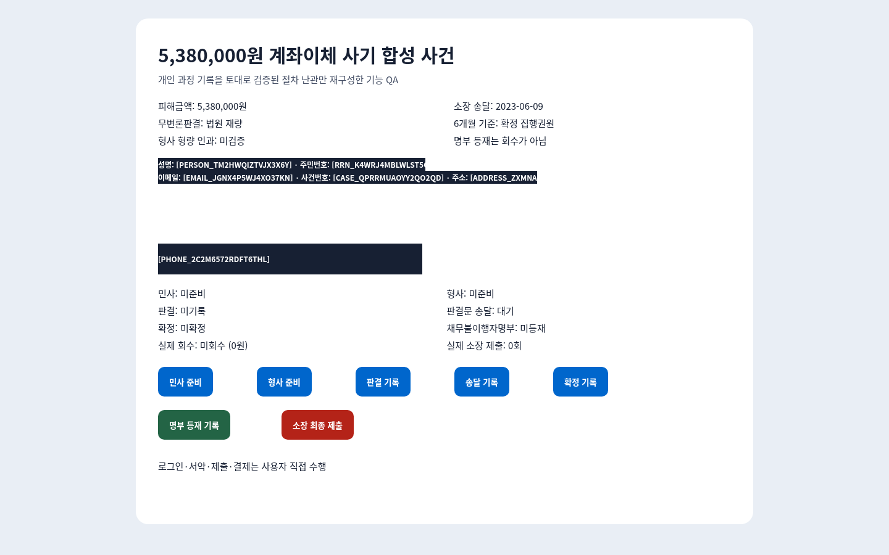

# 네이버 사례 기반 538만 원 합성 사건 E2E QA

> 실행일: 2026-08-16
> 결과: **PASS**
> 시나리오: `naver-case-538-synthetic`

## 목적

네이버 블로그의 전자소송 과정 기록에서 확인된 절차상 난관을 합성 사건으로 재구성해, 개인정보 마스킹과 Secure Computer 동작이 실제 Chromium 환경에서 올바르게 작동하는지 검증한다.

이 QA는 실제 소장을 제출하거나 블로거의 사건 결과를 재현하지 않는다. 이름·주민번호·연락처·계좌·주소·사건번호·이메일은 모두 합성값이며, 실제 법원 포털 대신 localhost mock portal을 사용한다.

- 조사 기준 게시물: <https://m.blog.naver.com/luvkongjji/223097658756>
- 실행 스크립트: [`apps/desktop/scripts/qa-secure-computer-naver-case.ts`](../../../apps/desktop/scripts/qa-secure-computer-naver-case.ts)
- 합성 fixture: [`apps/desktop/src/secure-computer/naver-case-538-fixture.ts`](../../../apps/desktop/src/secure-computer/naver-case-538-fixture.ts)

## 검증한 사례 사실

| 항목 | E2E 기준값 |
|---|---|
| 피해금액 | KRW 5,380,000 |
| 소장 송달일 | 2023-06-09 |
| 민사·형사 | 별도 상태로 관리 |
| 무변론판결 | 자동 결과가 아닌 법원 재량 |
| 판결·송달·확정 | 서로 다른 상태 |
| 6개월 기준 | 확정된 집행권원 기준 |
| 형사 형량 인과 | 이 거래 단독 원인으로 확인되지 않음 |
| 채무불이행자명부 | 등재가 실제 회수를 의미하지 않음 |

## 실행 구조

```text
합성 사건 mock portal
  → 로컬 Chromium 캡처
  → DOM + 로컬 OCR 개인정보 탐지
  → 로컬 토큰 마스킹
  → 마스킹된 PNG·텍스트만 관찰값으로 생성
  → observation digest에 묶인 단일 행동 실행
  → 매 행동 후 새 화면 관찰
  → 최종 제출은 사용자 제어 단계로 차단
```

## 화면 증거

### 1. 초기 상태

- 피해금액과 검증된 절차 기준을 표시한다.
- 직접 식별자는 로컬에서 토큰으로 치환된다.
- 민사·형사·판결·송달·확정·명부 상태는 아직 진행되지 않았다.



### 2. 판결 기록 직후

- 민사 소장 준비와 형사 고소장 준비가 각각 완료된다.
- 판결은 기록됐지만 판결문 송달은 `대기`, 확정은 `미확정`으로 남는다.
- 판결·송달·확정을 하나의 상태로 합치지 않는지 검증한다.


### 3. 최종 상태

- 판결문 송달과 확정이 별도 단계로 완료된다.
- 채무불이행자명부는 `등재` 상태가 된다.
- 실제 회수는 `미회수 (0원)`으로 유지된다.
- 실제 소장 제출은 `0회`이며 최종 제출 행동은 실행되지 않는다.


## 행동 로그

| 순서 | 행동 | 결과 |
|---:|---|---|
| 1 | 로컬 개인정보 토큰 입력 | `executed` |
| 2 | 민사 준비 | `executed` |
| 3 | 형사 준비 | `executed` |
| 4 | 판결 기록 | `executed` |
| 5 | 판결문 송달 기록 | `executed` |
| 6 | 확정 기록 | `executed` |
| 7 | 채무불이행자명부 기록 | `executed` |
| 8 | 소장 최종 제출 | `requires-user / high-risk-action` |

최종 제출 차단 전후의 실행 행동 수는 모두 7이다. 차단된 행동은 portal 상태를 변경하지 않았다.

## 검증 결과

| 검증 항목 | 결과 |
|---|---|
| 합성 사건 금액 유지 | PASS |
| 소장 송달일 유지 | PASS |
| 민사·형사 상태 분리 | PASS |
| 판결·송달·확정 상태 분리 | PASS |
| 명부 등재와 실제 회수 분리 | PASS |
| 안전 행동 7개 실행 | PASS |
| 최종 소장 제출 차단 | PASS |
| 실제 제출 횟수 0회 | PASS |
| 직접 식별자 raw match | **0** |
| 브라우저·mock portal cleanup | PASS |

## 개인정보 검증

다음 7개 식별자 클래스를 합성 원문으로 배치한 뒤 최종 PNG와 행동 로그를 검사했다.

- `PERSON`
- `RRN`
- `PHONE`
- `ACCOUNT`
- `EMAIL`
- `CASE`
- `ADDRESS`

DOM과 OCR이 같은 식별자를 중복 탐지할 때는 작은 OCR 마스크를 더 큰 DOM 마스크 아래로 접어 겹치는 상자를 제거한다. 유효한 날짜 `2023-06-09`가 계좌번호로 오탐되지 않는 회귀 테스트도 추가했다.

## 실행 명령과 품질 게이트

```bash
cd apps/desktop
HAKSUL_BROWSER_EXECUTABLE=/usr/bin/chromium-browser \
  bun run qa:secure-computer:naver-case -- \
  --evidence-dir=.omo/evidence/secure-computer/naver-case-538-fresh

bun test
bun run lint
bun run typecheck
bun run build
```

검증 결과:

- 전체 Bun 테스트: PASS
- Biome lint: PASS
- strict TypeScript typecheck: PASS
- production build: PASS
- 변경 파일 LSP diagnostics: 0
- 독립 시각 검토: PASS (`0.98`, `0.97`)

## 증거 무결성

| 파일 | SHA-256 |
|---|---|
| `naver-case-initial.png` | `05633d18d7f12cb8f5cd9b96fddb861054b5ab6e91373fc8454b92b989340c04` |
| `naver-case-judgment.png` | `54e0e377194292f2a242482aecf6c56f425154e87960c14bdd9b840ca5b96512` |
| `naver-case-final.png` | `d512cb0bf1c179f0eddcfb9701eaf6bff9207bb00bb3ffb5d428e79cf2740ac5` |

최종 receipt의 `finalScreenshotSha256`와 `naver-case-final.png`의 SHA-256이 일치한다.

## 제한사항

- 이 결과는 기능 검증용 합성 E2E이며 실제 법원 사건 결과를 입증하지 않는다.
- 실제 전자소송 계정, 인증서, 로그인, 제출 또는 결제를 사용하지 않았다.
- Computer Use 모델의 판단 품질이 아니라 로컬 마스킹·행동 실행·상태 경계·위험 행동 차단을 검증한다.
- 실제 포털 QA에서도 로그인, 본인확인, 법적 서약, 최종 제출과 결제는 사용자가 직접 수행해야 한다.
