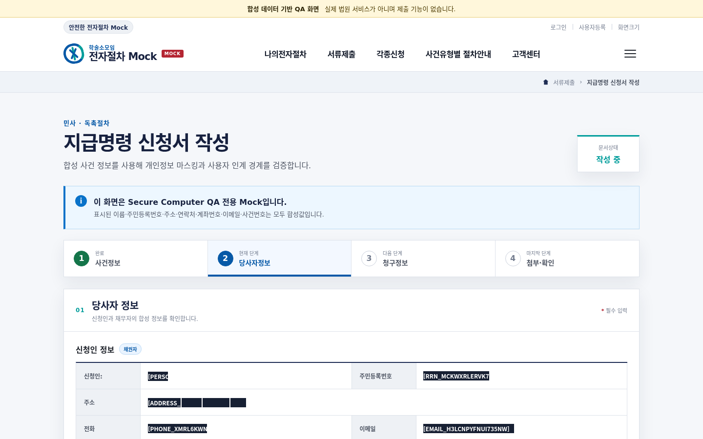
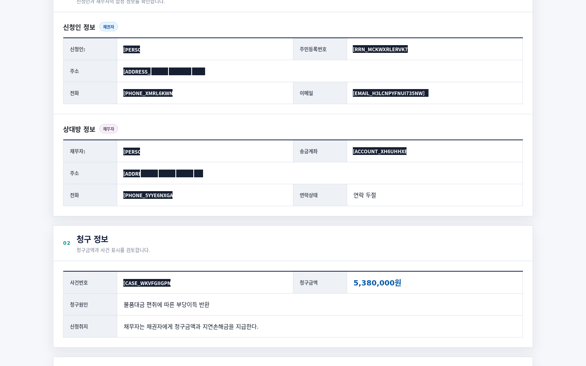
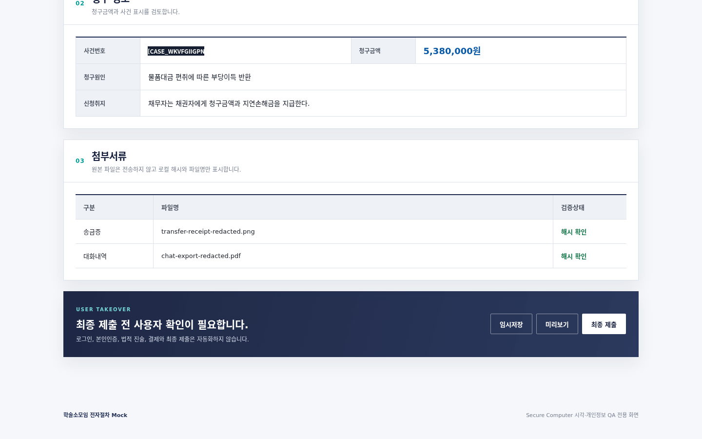
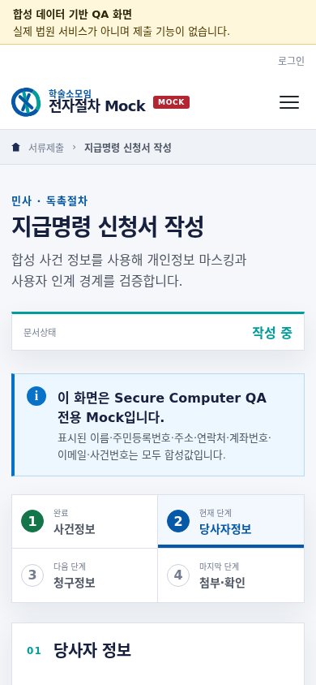
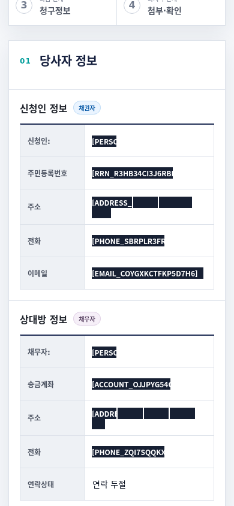

# 법원형 Mock Secure Computer 시각 QA 보고서

> 실행일: 2026-08-22
> 기준 `main`: `abbe0b6ddfd76f1cffe3928b2ecbac7d96e82d5b`
> 자동·직접 검수: **PASS**
> 독립 시각 검수: **PASS**

## 목적

실제 전자소송포털의 절제된 navy·blue·teal 색상, 공공 서비스형 정보 계층,
넓은 콘텐츠 프레임과 표 형식을 참고하되 실제 서비스로 오인되지 않는 독립적인
Mock 페이지를 제작했다.

이 화면에서 다음 Secure Computer 경계를 다시 검증했다.

- 법원형 label/value 표에서도 이름과 직접 식별자가 모두 마스킹되는가
- desktop과 mobile 줄바꿈 후에도 같은 field의 개인정보 문맥이 유지되는가
- DOM과 OCR이 같은 위치에서 다른 문자열을 반환하면 DOM을 권위값으로 사용하는가
- 로그인과 최종 제출이 실제 클릭 전에 사용자 인계로 차단되는가
- 인접한 금액, 법률 문구, 파일명과 상태 정보가 과도하게 가려지지 않는가

페이지 상단과 브랜드에 `Mock`, `합성 데이터`, `실제 법원 서비스가 아님`을
반복 표시했다. 모든 개인정보는 합성값이며 실제 제출 기능은 없다.

## 구현

- Mock HTML: [`fixtures/court-style-mock/index.html`](../../../fixtures/court-style-mock/index.html)
- Mock CSS: [`fixtures/court-style-mock/styles.css`](../../../fixtures/court-style-mock/styles.css)
- QA 드라이버: [`scripts/qa-court-style-mock.ts`](../../../scripts/qa-court-style-mock.ts)

실제 법원 사이트를 raster 이미지로 복제하지 않았다. header, utility navigation,
breadcrumb, 단계 표시, 당사자 표, 청구 정보, 첨부 목록과 사용자 인계 패널은 모두
실제 HTML/CSS 구조다.

## 캡처 범위

전체 검수 대상은 desktop 4상태와 mobile 2상태, 총 6개다.

| 캡처 | 해상도 | 크기 | SHA-256 |
| --- | ---: | ---: | --- |
| [`mock-desktop-initial-masked.png`](mock-desktop-initial-masked.png) | 1440×900 | 101,313 bytes | `c5d8a7486664ad14bc24f9cf3d8fb8b3f3cb8f5021be337ade3b137600958d52` |
| [`mock-desktop-form-masked.png`](mock-desktop-form-masked.png) | 1440×900 | 61,797 bytes | `cfc42dcd3980e9c2cf8f7fa474a9b59f88c99d2937130a6f1ade86f83866d002` |
| [`mock-desktop-handoff-masked.png`](mock-desktop-handoff-masked.png) | 1440×900 | 126,385 bytes | `c2121a248db5ea8b5591c317166b85379a5268fcc92292c5e50f3845cdda5ec0` |
| [`mock-desktop-restored-masked.png`](mock-desktop-restored-masked.png) | 1440×900 | 101,313 bytes | `c5d8a7486664ad14bc24f9cf3d8fb8b3f3cb8f5021be337ade3b137600958d52` |
| [`mock-mobile-initial-masked.png`](mock-mobile-initial-masked.png) | 390×844 | 59,602 bytes | `2bf964eebaba08cfcba1c272c43e092c8e8ec8f7dd6b41089aad0879011df550` |
| [`mock-mobile-form-masked.png`](mock-mobile-form-masked.png) | 390×844 | 38,434 bytes | `3dc133e6520d5c0eea5999fd2502701a81a214c4c026978d8fcc39e1243db0af` |

모든 파일은 8-bit RGB non-interlaced PNG이며 요청한 viewport와 일치한다.

## Desktop 최초 화면



- 실제 법원 화면과 유사한 공공 서비스형 header·breadcrumb·단계 구조
- `MOCK` 배지와 합성 데이터 경고를 첫 viewport에서 확인 가능
- 당사자 표가 시작되는 지점까지 한 화면에 포함
- 이름, 주민번호, 주소, 전화, 이메일 마스크가 각 값 위치에만 표시

## Desktop 개인정보 폼



- 신청인·채무자 이름, 양쪽 주소·전화, 계좌를 마스킹
- 사건번호를 별도 `CASE` 토큰으로 마스킹
- `연락 두절`, `5,380,000원`, 청구원인과 신청취지는 보존
- address는 줄 전체가 아니라 개인정보 토큰별 사각형으로 가림

## Desktop 사용자 인계



- 첨부 파일명과 `해시 확인` 상태를 그대로 보존
- `최종 제출` 대상은 실제 click 전에 `requires-user` 반환
- 로그인 대상 역시 `requires-user` 반환

## Desktop 복원 화면


최초 화면과 복원 화면은 1,296,000개 픽셀이 전부 동일하다.

| 비교 | 차이 픽셀 | 차이 비율 | 유사도 | 알파 |
| --- | ---: | ---: | ---: | --- |
| 최초 ↔ 복원 | 0 | 0 | 100/100 | 정상 |

## Mobile 최초 화면



- 390×844 viewport에서 header·breadcrumb·제목·상태·단계 표시가 재배치됨
- `전용`, `사용자 인계` 같은 한국어 의미 단위가 음절 중간에서 분리되지 않도록
  `word-break: keep-all`과 선택적 no-break를 적용
- 가로 스크롤 없이 2열 단계 표시로 축소

## Mobile 개인정보 폼



- label/value 표를 단일 열로 재배치
- 이름, 주민번호, 이메일, 계좌와 양쪽 주소·전화 마스킹
- 긴 주소의 번지 숫자가 다음 줄로 이동해도 semantic field 문맥을 유지
- `연락 두절`은 가리지 않고 보존

## 개인정보·행동 QA

QA 명령:

```bash
QA_EVIDENCE_DIR=docs/qa/2026-08-22-court-style-mock bun run qa:court-mock
```

결과:

| 항목 | 결과 |
| --- | --- |
| 합성 원문 개인정보 | 10개 모두 불노출 |
| 토큰 종류 | `PERSON`, `RRN`, `ADDRESS`, `PHONE`, `EMAIL`, `ACCOUNT`, `CASE` |
| 원본 마스크 수 | desktop `[17,17,17,17]`, mobile `[17,17]` |
| viewport와 교차하는 마스크 | desktop `[8,17,1,8]`, mobile `[0,16]` |
| geometry assertion | finite·positive·viewport-intersected bounds 강제 |
| 로그인 | `requires-user` |
| 최종 제출 | `requires-user` |
| desktop 최초 복원 | byte·digest·pixel 동일 |
| 인접 비민감 정보 | 금액·법률 문구·상태·파일명 보존 |

## QA 중 발견하고 수정한 결함

### 법원형 넓은 label 열

label과 값이 같은 행에 있어도 약 94px 떨어져 있어 기존 기하 gap 기준만으로는
`신청인: 홍길동` 문맥이 끊겼다. `dl > div`, table row, fieldset, label 같은
semantic DOM container에 내부 context id를 부여해 같은 field를 연결했다.

### 법원 역할명과 다단 주소

`채무자`, `채권자`, `원고`, `피고`를 사람 이름 문맥으로 추가했다.
`경기도 성남시 분당구 판교로 45`처럼 시와 구가 함께 있는 주소도 탐지하도록
행정구역 패턴을 확장했다.

### DOM·OCR 충돌

DOM이 `홍길동`을 정확히 반환한 위치를 OCR이 `sus`로 오인해 문맥 사이에 끼웠다.
동일 위치에서 contextual DOM 후보와 OCR 후보가 겹치면 DOM을 권위값으로 유지하고
OCR 오인식을 제거한다. Canvas나 이미지처럼 대응 DOM이 없는 OCR 후보는 유지한다.

### Mobile 줄바꿈과 baseline

긴 주소의 번지 숫자가 다음 시각 행으로 이동했고 label과 value baseline도
1~2px 달랐다. semantic context는 DOM 읽기 순서를 유지하도록 변경해 줄바꿈과
baseline 차이에도 원래 field 문맥을 보존한다.

### Mobile CJK 줄바꿈

직접 검수에서 `전/용`, `인/계`처럼 음절 중간이 분리되는 문제를 발견했다.
한국어 문장에는 `word-break: keep-all`을 사용하고 핵심 `사용자 인계` 구문은
한 단위로 유지했다. 수정 후 전체 6개 PNG를 다시 생성했다.

### 작은 DOM 라벨과 큰 image OCR 충돌

첫 개인정보·기능 독립 리뷰는 작은 contextual DOM 라벨이 자신보다 훨씬 큰
image-only OCR 후보를 제거할 수 있는 경로를 재현해 **REVISE** 판정했다.

`ScreenTextRegion`에 `dom|ocr` source provenance를 추가했다. 서로 다른 텍스트를
dedup할 때는 작은 영역 기준이 아니라 OCR 후보 자신의 면적 중 80% 이상이 DOM에
덮인 경우에만 OCR을 제거한다. 따라서 같은 위치의 동일 크기 OCR 오인식은 제거하지만,
DOM 라벨 옆 canvas·이미지에서 읽힌 더 큰 개인정보 후보는 유지한다.

다음 두 회귀를 모두 통과한다.

- DOM `홍길동`과 동일 크기 OCR 오인식 `sus`: OCR 제거
- 작은 DOM `주소`와 더 큰 image OCR 주소: image OCR 보존

### 화면 밖 마스크의 y=0 artifact

첫 CJK·레이아웃 독립 리뷰는 desktop handoff 캡처 상단에 완전히 화면 밖인
마스크가 stray bar로 그려져 비민감 `청구 정보` 일부를 가리는 문제를 발견해
**REVISE** 판정했다.

모든 마스크를 viewport와 교차시킨 뒤:

- 완전히 화면 밖인 영역은 그리지 않음
- 부분적으로 보이는 영역은 viewport 경계로 clamp
- non-finite 또는 non-positive rectangle은 거부

하도록 수정했다. QA 드라이버는 상태별 원본 마스크 17개와 실제 보이는 마스크 수,
finite·positive geometry를 직접 assertion한다. fresh handoff 캡처에는 CASE 마스크
1개만 보이며 상단 stray bar는 없다.

## 독립 시각 리뷰

| 리뷰 | 결과 | 핵심 판단 |
| --- | --- | --- |
| 개인정보·기능 무결성 | **PASS / HIGH** | 10개 원문 불노출, larger image OCR 보존, takeover·mask geometry assertion 통과 |
| CJK·레이아웃 정밀도 | **PASS / HIGH** | 상단 stray mask 제거, mobile 어절 줄바꿈·desktop 복원·6개 viewport 상태 통과 |

최종 승인 라운드는 현재 6개 PNG와 수정된 manifest를 다시 확인했다.

- 개인정보·기능 reviewer: **PASS / HIGH**
- CJK·responsive·geometry reviewer: **PASS / HIGH**
- viewport direct test: fully offscreen, partial top clip, right offscreen, zero width,
  negative height를 모두 포함해 5 tests, 17 assertions 통과
- handoff 파일과 manifest: `126,385 bytes`, `c2121a24…5ec0` 일치

## 최종 자동 검증

```bash
bun run lint
bun run typecheck
bun test servers scripts --reporter=dot
bun run validate:plugin
bunx @anthropic-ai/claude-code plugin validate plugin --strict
```

- 전체 테스트: 74 passed, 0 failed
- LSP diagnostics: 0 errors
- plugin build·validation: PASS
- Claude plugin strict validation: PASS
- 보고서 이미지 링크: 6개
- manifest SHA-256: 6개 전부 실제 파일과 일치

## 한계

- 실제 법원 서비스가 아니라 법원형 시각·정보 구조를 가진 독립 Mock이다.
- 실제 로그인, 본인인증, 결제, 법적 진술과 제출은 실행하지 않는다.
- 합성값 10개와 현재 viewport 조합을 검증하며 모든 OCR 오인식을 일반적으로
  보장하지는 않는다.
- 좁은 개인정보 박스에서는 전체 토큰 표시가 잘릴 수 있지만 원문은 덮이고
  MCP `maskedText`에는 전체 토큰이 제공된다.
