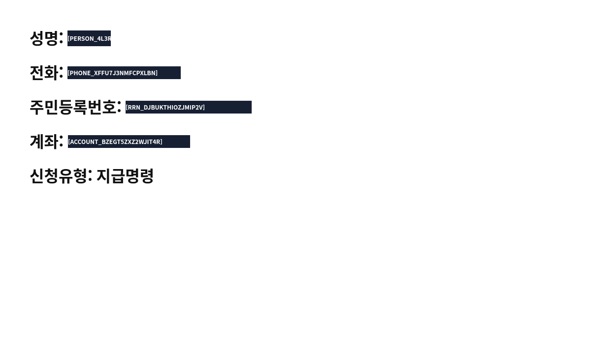
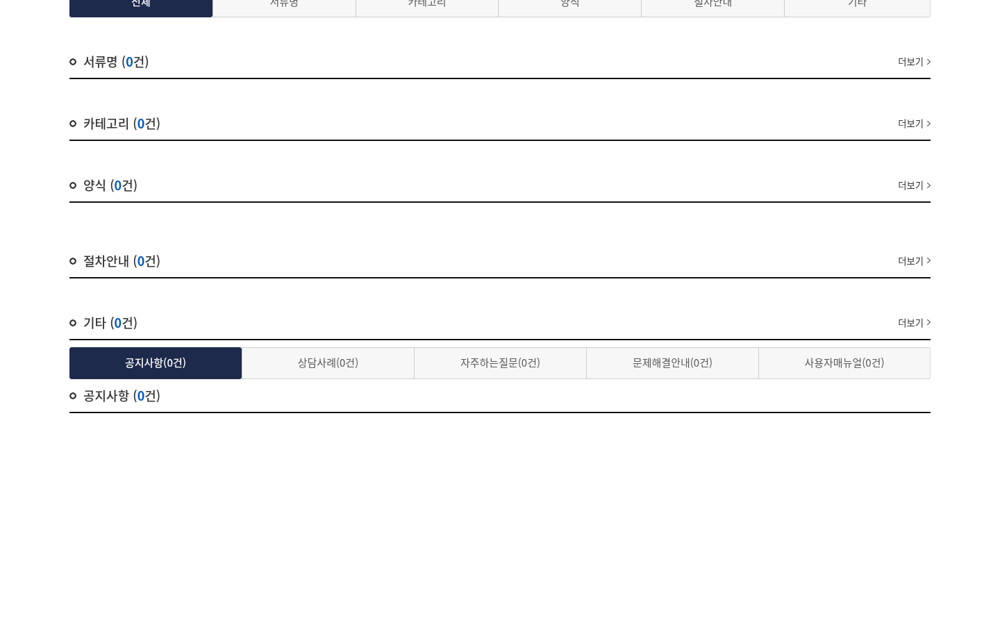
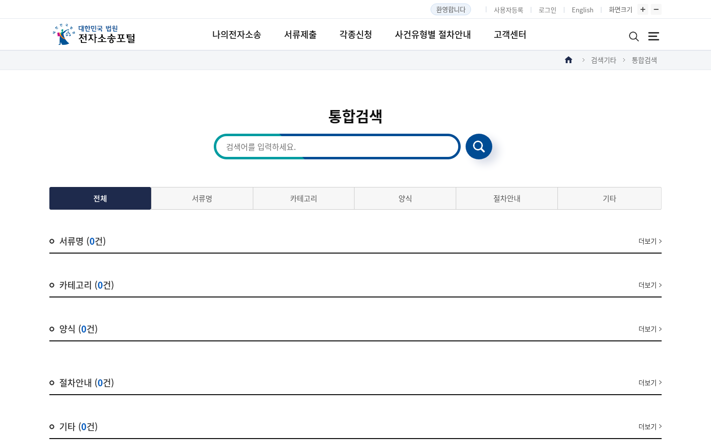

# Secure Computer 시각 QA 보고서

> 실행일: 2026-08-22
> 기준 `main`: `d11d5a03e85a7075ad314b0ff74b4e67d3750dfc`
> 결과: **PASS**
> 실제 사이트: <https://ecfs.scourt.go.kr/psp/index.on?m=PSP004M01>

## 목적

Secure Computer가 생성한 마스킹 PNG를 파일로 보존하고 직접 열어 다음 항목을
검증했다.

- 개인정보 원문 글자가 마스크 경계 밖으로 노출되지 않는가
- 개인정보 값만 가리고 라벨과 인접한 비민감 법률 문구는 보존하는가
- 실제 전자소송포털 화면이 빈 화면이나 정적 대체 이미지가 아니라 완전히 렌더링되는가
- 안전한 스크롤 후 원래 화면으로 정확히 복원되는가
- 로그인 동작이 실제 클릭 전에 사용자 인계로 차단되는가

원본 개인정보 화면은 저장하거나 커밋하지 않았다. 합성 개인정보만 사용했으며,
저장소에는 마스킹이 완료된 PNG만 포함한다.

## 캡처 범위

검수 대상은 총 4개 화면이며 일부 화면만 표본으로 선택하지 않았다.

| 화면 | 해상도 | 크기 | SHA-256 |
| --- | ---: | ---: | --- |
| [`ocr-identifiers-masked.png`](ocr-identifiers-masked.png) | 1200×700 | 26,403 bytes | `a474fbbfda97eca90cee341bce94cfe7edb71526ec11f441ca8d48db200dd099` |
| [`court-initial-masked.png`](court-initial-masked.png) | 1440×900 | 54,616 bytes | `c871f82bb416440d2c29e625419abca5e5907263b175512443e862caf41fa868` |
| [`court-scrolled-masked.png`](court-scrolled-masked.png) | 1440×900 | 34,213 bytes | `0b987fe4492a30e3e14866cb815c0413bfb0e496b265718946e0feb172fe1de0` |
| [`court-restored-masked.png`](court-restored-masked.png) | 1440×900 | 54,616 bytes | `c871f82bb416440d2c29e625419abca5e5907263b175512443e862caf41fa868` |

네 파일 모두 8-bit RGB non-interlaced PNG이며 요청한 viewport와 크기가 일치한다.

## 합성 개인정보 화면



Canvas에만 다음 합성값을 그려 DOM 텍스트의 도움 없이 Tesseract OCR과 마스킹을
검증했다.

- 사람 이름
- 휴대전화번호
- 주민등록번호
- 계좌번호
- 비민감 문구 `신청유형: 지급명령`

결과:

- `PERSON`, `PHONE`, `RRN`, `ACCOUNT` 네 종류에 정확히 4개 마스크 생성
- 이름·전화·주민번호·계좌 원문 글자 및 가장자리 픽셀 노출 없음
- 원본 민감 픽셀 10,266개가 모두 마스크 안에 포함되고 생존 픽셀은 0개
- 마스크 바깥에서 변경된 픽셀과 인접 비민감 글자 침범 모두 0개
- `성명:`, `전화:`, `주민등록번호:`, `계좌:` 라벨 보존
- `신청유형: 지급명령` 전체 보존
- 저장된 마스킹 PNG를 다시 OCR한 결과 알려진 합성 원문 4개 모두 불검출
- 좁은 이름 박스에서는 토큰 표시 문자열 뒷부분이 잘리지만 원문은 완전히 덮이고,
  MCP의 `maskedText`에는 전체 토큰이 별도로 제공되므로 개인정보·기능상 결함은 아님

## 실제 법원 포털

### 최초 관찰


### 400px 스크롤



### 원래 위치 복원



실제 사이트 검증 결과:

- WebSquare 비동기 렌더링 완료 후 정상 화면 캡처
- 빈 화면, 검은 영역, 누락된 compositor 영역 없음
- 한글 메뉴·검색 영역·목록 라인에 클리핑이나 tofu 없음
- 스크롤 아래/위 동작 모두 `executed`
- 최초 화면과 복원 화면은 1,296,000개 픽셀이 전부 동일
- 로그인 대상은 실제 클릭 전에 `requires-user(authentication-field)` 반환

이 공개 로그인 전 화면에는 개인정보가 없으므로 법원 캡처는 실제 사이트 렌더링과
행동 경계를 검증한다. 개인정보 박스의 시각 정확도는 위 합성 OCR 화면으로 검증했다.

## 객관적 이미지 비교

| 비교 | 크기 일치 | 차이 비율 | 유사도 | 알파 | 해석 |
| --- | --- | ---: | ---: | --- | --- |
| 최초 ↔ 복원 | 예 | `0` | `100/100` | 정상 | 왕복 스크롤 후 정확히 같은 viewport로 복원 |
| 최초 ↔ 스크롤 | 예 | `0.1969` | `80/100` | 정상 | 400px 스크롤에 따른 의도된 화면 차이 |

최초·복원 비교에는 hotspot이 없었다. 스크롤 비교의 hotspot은 목록과 탭이
viewport 안팎으로 이동한 영역이며 캡처 결함이 아니다.

## 독립 시각 리뷰

| 검수 | 결과 | 핵심 판단 |
| --- | --- | --- |
| 개인정보·기능 무결성 재검수 | **PASS / HIGH** | 원본 민감 픽셀 10,266개 전부 차단, 바깥 변경 0, 비민감 글자 침범 0, 실제 포털·스크롤·로그인 인계 정상 |
| 한글·레이아웃 정밀도 재검수 | **PASS / HIGH** | 네 마스크 모두 가장자리 누출 0, 라벨 간격 9~10px 보존, CJK tofu·baseline·줄바꿈·viewport 결함 없음 |

## 결함 발견과 수정

첫 번째 독립 픽셀 검수에서는 OCR이 읽지 못할 정도로 작지만 원문 안티앨리어싱
픽셀이 마스크 가장자리에 남아 있어 **REVISE** 판정을 받았다.

| 값 | 최초 발견된 가장자리 픽셀 |
| --- | ---: |
| 사람 이름 | 18 |
| 전화번호 | 10 |
| 주민등록번호 | 11 |
| 계좌번호 | 4 |

OCR 재검출 0건만으로는 픽셀 수준 개인정보 차단을 증명할 수 없으므로, 민감 영역을
`floor - 1px`부터 `ceil + 1px`까지 바깥쪽으로 확장했다. 정확한 좌표 회귀 테스트를
추가하고 네 화면을 모두 다시 생성했다.

새 캡처의 독립 개인정보·기능 재검수 결과:

- 원본 민감 픽셀: 10,266
- 마스크 밖에 남은 민감 픽셀: 0
- 마스크 안에서 생존한 민감 픽셀: 0
- 마스크 밖에서 불필요하게 변경된 픽셀: 0
- 인접 비민감 글자 침범: 0

## 재현 명령

```bash
QA_EVIDENCE_DIR=docs/qa/2026-08-22-secure-computer bun run qa:ocr
QA_EVIDENCE_DIR=docs/qa/2026-08-22-secure-computer bun run qa:court
```

초기·복원 이미지 비교:

```bash
node "$VISUAL_QA_SKILL/scripts/visual-qa.mjs" image-diff \
  docs/qa/2026-08-22-secure-computer/court-initial-masked.png \
  docs/qa/2026-08-22-secure-computer/court-restored-masked.png
```

## 한계와 판정

- 실제 로그인, 본인인증, 결제, 법적 진술, 최종 제출은 의도적으로 실행하지 않았다.
- 실제 포털의 로그인 전 공개 화면에는 개인정보가 없어 합성 화면을 개인정보
  마스킹 기준으로 사용했다.
- OCR이 개인정보 원문 자체를 완전히 오인하는 경우까지 이 시각 QA가 보장하지는 않는다.
- 화면의 마스크 토큰 표시는 원래 값의 좁은 너비에 맞춰 잘릴 수 있지만 원문 차단과
  모델 입력용 전체 토큰에는 영향이 없다.

현재 증거에서는 차단 결함이 없으며, Secure Computer의 마스킹 시각 QA 판정은
**PASS**다.
